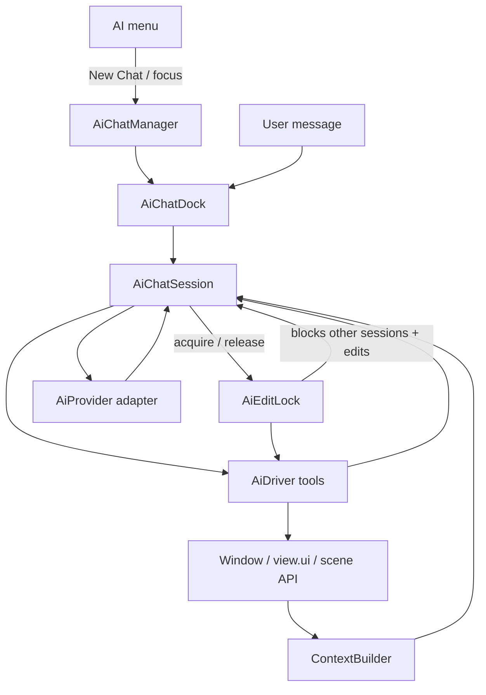

# AI chat pane

Implementation plan for a configurable AI assistant in ConnectEd. Users chat in
natural language; the assistant reads diagram context and invokes structured
**tools** (not raw mouse events) to operate the GUI — similar in spirit to
Cursor’s agent loop for code, but built on ConnectEd’s existing scripting and
scene APIs.

## Goals

- **Multiple chat docks** — users can open more than one AI conversation at a
  time (separate history and session per dock).
- **Dock widget** chat UI integrated with the main window (like Messages /
  Transcript).
- **Top-level AI menu** — New Chat, dynamic list of open chats, Recipes
  (curated workflows), Settings.
- **Configurable providers** — model, API key, base URL; swappable backends.
- **AI driver** — tool catalog the model can call; implementations delegate to
  [`ConnectEd/scripting/`](../ConnectEd/scripting/) and scene/view APIs with undo.
- **Exclusive editing lease** — only one AI chat may run write tools (or hold the
  scene for an agent loop) at a time; see [Agent editing lease](#agent-editing-lease).
- **Terse command catalog** in the system prompt so the model knows what ConnectEd
  can do (Place, Edit, View, scene operations).

## Non-goals (initially)

- Embedding **Cursor Composer 2.5** as an in-app provider (no public Composer API
  for third-party apps today; see [Providers](#providers)).
- Arbitrary **Python execution** of model-generated code in the GUI process
  (prefer explicit tools).
- Cloud-hosted ConnectEd backend or multi-user chat history sync.
- Full **preferences dialog** for all app settings (AI section can start minimal).
- **Web chat UI integration** — no copy/paste bridge, embedded provider pages, or
  automation against vendor websites; use **official APIs** or **local** models
  (e.g. Ollama) only.
- **Recorded UI macros** — Recipes are curated prompts + context, not QTest replay.
- **Full-window modal freeze** during every agent reply — use a **partial** edit lock
  instead (see [Agent editing lease](#agent-editing-lease)); optional strict mode later.

## Current state

**Implemented:**

- [`ConnectEd/ai/`](../ConnectEd/ai/) — `types`, `AiDriver`, `AiChatSession`, `AiChatProviderWorker`
  (`chat_worker.py`), `AiEditLock`, `profiles`, `profile_models`, `chat_mru`, `welcome`, provider registry
  (`registerProvider` / `createProvider` / `createProviderForProfile`).
- **Real providers** — `xai`, `openai`, `anthropic`, `ollama`, `openai_compatible`
  (`openai`, `anthropic` in [`pyproject.toml`](../pyproject.toml) core dependencies).
- [`ConnectEd/widgets/window/ai/`](../ConnectEd/widgets/window/ai/) —
  `AiChatManager`, `AiChatDock`, `AiChatWidget` (`QTextBrowser` history with links,
  input, Send).
- **Disconnected / connected** — new chats start **disconnected** (no profile/model bound);
  input shows dim italic `disconnected` and is disabled until the user picks a model.
  Connected chats bind `profile_id` + `model` and create a real provider on send.
- **Welcome** — [`ConnectEd/ai/welcome.py`](../ConnectEd/ai/welcome.py): settings link
  (no profiles), or **Recent** MRU (up to 10, persisted in `ai/chat_mru`) plus full
  `provider:key:model` list; `connected://ai/settings` and `connected://ai/chat?…` links.
- **AI Profiles** — [`AiProfilesDialog`](../ConnectEd/widgets/dialogs/ai_profiles.py);
  multi-profile credentials; model lists cached per profile (`profile_models.py`).
- **Settings** — `ai/` section in [`settings.yaml`](../ConnectEd/core/settings.yaml)
  (`profiles_data`, `chat_mru`).
- **Window** — [`AiManager`](../ConnectEd/widgets/window/ai/manager.py) (edit lock, profile
  refresh, chat docks); one default chat on startup; bottom split (log tabs left, AI right).
- **AI menu** — New Chat → profile → model submenu, dynamic open-chat list, Settings…
- **Tests** — unit tests for providers, profiles, MRU, welcome, edit lock, unbound chat;
  `MAIN_WIDGETS["AI Chat"]` in [`specs.py`](../tests/integration/gui/specs.py).

**Not yet implemented:**

- `ContextBuilder`, read/write tools beyond scaffolding `nobodyHome` on `AiDriver`.
- **Recipes** submenu (placeholder only).
- Dock titles using `AI Chat - [disconnected]` / `AI Chat - [provider:key:model]` format
  (today: `AI Chat [no provider]` or `AI Chat [profile/model]`).

**Existing infrastructure to build on:**

- **Scripting stack** — [`doc/SCRIPTING.md`](SCRIPTING.md):
  - `cs.gui(window)` → `GuiDriver` (menus, modals, mouse, docks).
  - `view.*` — Place / Edit / View on active MDI subwindow.
  - Scene API — `addItems`, `editMove`, diagram APIs with `undoable=True`.
- **Command trees are manual** — [`tests/integration/gui/specs.py`](../tests/integration/gui/specs.py)
  (`MAIN_WIDGETS`, `MENUS_*`); no runtime introspection registry.

## Architecture



| Layer | Responsibility |
|-------|----------------|
| **AiChatManager** | Owns open `AiChatDock` instances; create, focus, title, menu list |
| **AiChatDock** | Qt UI shell: history, input, send/stop, provider/model indicator, errors |
| **AiChatSession** | Per-dock message list, system prompt, tool-call loop, streaming |
| **AiEditLock** | Exclusive editing lease; partial UI lock while a session runs write-capable agent loop |
| **AiProvider** | HTTP/SDK to OpenAI, Anthropic, Ollama, etc.; tools + streaming |
| **ContextBuilder** | Active document, selection, scene/net summary for prompts |
| **AiDriver** | Registered tools; maps tool calls → scripting/scene/view calls |
| **Command catalog** | Terse tool/menu documentation for system prompt |
| **Recipes** | Curated prompt + context starters (menu actions, not tool replay) |

**Design rule:** the model **never** drives raw `QTest` mouse directly in v1.
It calls **named tools** with structured arguments. Mouse-based placement stays
inside tool implementations (or future placement tools) where drag threshold and
modal handling are handled deliberately.

## Menu: top-level **AI** (not under Window)

Use a dedicated **AI** menu bar entry. Do **not** nest AI under **Window** —
Window already lists fixed docks and dynamic MDI documents; AI has its own
lifecycle (new chat, recipes, settings).

### Structure

```
AI
  New Chat
  ─────────
  AI Chat          ← dynamic: one entry per open dock (show/raise)
  AI Chat 2
  ─────────
  Recipes          ← submenu; stage later
    HDL → Diagram
    …
  ─────────
  Settings…
```

| Item | Behaviour |
|------|-----------|
| **New Chat** | `AiChatManager.newChat()` — create dock, focus, update menu |
| **Open chats** | Rebuilt by `updateAiMenu()` (same pattern as MDI list in `updateWindowMenu()`) |
| **Recipes** | Open/focus chat, pre-fill prompt + context; optional auto-send (see [Recipes](#recipes)) |
| **Settings…** | Stub → prefs dialog writing `ai/*` settings |

**Window menu** keeps Navigator, Messages, Transcript, Log only. Remove
`windowAiChat` once the AI menu is wired. Optional later: **Window → Focus AI
Chat** that raises the most recently used chat (single shortcut only; no duplicate
list).

**Integration tests:** extend `MENUS_*` in [`specs.py`](../tests/integration/gui/specs.py)
with an `"AI"` menu tree; adjust `MAIN_WIDGETS` for multi-dock (see below).

## Multiple chat docks

Today `Window` holds a single `_ai_chat_dock`. Refactor to **`AiChatManager`**
(owned by `Window` or co-located under `widgets/window/ai/`):

- **`newChat() -> AiChatDock`** — allocate id, default title (`"AI Chat"`,
  `"AI Chat 2"`, …), create session, add dock to bottom-right pane.
- **`chats() -> list[AiChatDock]`** — for menu and scripting.
- **`focusChat(dock)`** — show, raise, optionally tabify among AI docks only.
- **`closeChat(dock)`** — on dock close: remove from list, update AI menu.
- **Titles** — start numeric; later: first user message snippet or user rename.

Each **`AiChatWidget`** owns one **`AiChatSession`** (already the case). Sessions
do not share history.

### Dock layout

**Resolved** — bottom horizontal split:

| Region | Docks |
|--------|--------|
| **Bottom left** | Messages, Transcript, Log (tabbed together) |
| **Bottom right** | One or more **AI Chat** docks (tabbed with each other, **not** with Messages/Transcript/Log) |

Setup order in [`Window`](../ConnectEd/widgets/window/__init__.py) matters for Qt:

1. Add Messages to bottom.
2. Add first AI Chat to bottom; `splitDockWidget(messages, aiChat, Horizontal)`.
3. Add Transcript and Log; tabify with Messages only.
4. Further AI chats: add to bottom-right area; tabify with existing AI docks.

Saved window geometry (`startup/geometry`) can restore an old tab arrangement;
users may need to reset layout once after dock changes.

## Agent editing lease

With **multiple chat docks**, each `AiChatSession` has its own history, but
**`AiDriver` shares one window** — one active MDI view, one scene, one undo stack.
Without coordination, two agent loops (or user edits interleaved with AI tools)
can corrupt state.

### Exclusive lease (lock / unlock)

Introduce **`AiEditLock`** (on [`Window`](../ConnectEd/widgets/window/__init__.py)
or owned by `AiChatManager`):

```python
class AiEditLock(QObject):
    lockChanged = pyqtSignal()

    def holder(self) -> AiChatSession | None: ...
    def isLocked(self) -> bool: ...
    def acquire(self, session : AiChatSession) -> bool: ...
    def release(self, session : AiChatSession) -> None: ...
```

**Bracket** each agent run that may mutate the diagram:

```
send() → acquire(session) → tool loop → release(session)   # always in finally
```

| Rule | Behaviour |
|------|-----------|
| **Holder** | Only the session that acquired the lease may invoke **write** tools |
| **Other chats** | **Send** disabled or rejected with “Chat N is editing…”; read-only tools optional |
| **User manual edits** | Blocked on the active scene while lease held (partial UI lock) |
| **Stop / Cancel** | Aborts provider + **releases** lease in `finally` |
| **Close chat dock** | If holder, **release** on destroy |
| **Failure** | `release` in `finally` — never leave the app locked |

Read-only tools (`get_selection_summary`, `list_commands`, …) may run **without**
the lease, or concurrently while another chat holds it — default: **read-only without
lease**, **write requires lease**.

Write tools (`edit_delete`, `scene_add_items`, `run_menu_action`, …) **must**
check `AiEditLock` before executing (defence in depth).

### Partial UI lock (not a full modal)

Do **not** freeze the entire application for every assistant reply. While the lease
is held:

| Block | Allow |
|-------|--------|
| Scene mouse edits, Edit menu mutations, Place menu | View pan / zoom |
| Other chats’ **Send** (and write agent loops) | **Stop** on the holding chat |
| Destructive menu actions on the active design | Messages, Navigator browse, log docks |
| | Typing in other chat inputs (Send still blocked) |

Optional later setting **`ai/strict_agent_lock`** — also disable pan/zoom during
write loops (off by default).

### User-visible state

- Holding dock title or banner: **`Editing…`** (in addition to `[provider]` suffix).
- Other docks: grey **Send**, tooltip explaining which chat holds the lease.
- Optional status bar: `AI: Chat 2 editing`.

Connect `AiEditLock.lockChanged` → refresh all `AiChatWidget` send buttons and
menu sensitivity.

### Phasing

| Stage | Lease scope |
|-------|-------------|
| **§3.5 skeleton** | `AiEditLock` type, acquire/release in `AiChatSession.send()`; UI hints optional |
| **§5 read-only agent** | Lease bracketing validated; read tools run without blocking other chats |
| **§6 write tools** | **Required** — write tools refuse without lease; partial UI lock enforced |
| **§8 polish** | Stop/cancel releases lease (**done**); integration test: Chat A blocks Chat B **Send** |

### Rejected alternatives

- **No lock** — unsafe once write tools exist.
- **Global tool queue** — Chat B silently waits; confusing UX.
- **Single “active agent chat”** — defeats multi-chat for parallel Q&A (read-only).

## Recipes

**Recipes** (UI label; not “macros”) are **curated workflows** — not recorded UI
automation. Each recipe:

- Opens or focuses a chat (usually **New Chat** with a recipe-specific system appendix).
- Pre-fills user input and/or injects context (selection, active design, clipboard).
- May restrict tools (e.g. read-only pass before write tools for HDL → diagram).

Example entries (later):

| Recipe | Intent |
|--------|--------|
| **HDL → Diagram** | Parse HDL snippet into blocks/nets via write tools |
| **Explain selection** | Read-only context + summary |
| **Document netlist** | `get_netlist_summary` + narrative |

Implement in [`ConnectEd/ai/recipes.py`](../ConnectEd/ai/recipes.py); menu
built from a registry (similar to `registerProvider`).

## Providers

### Pluggable adapter

```python
class AiProvider(Protocol):
    def chat(
        self,
        messages : list[ChatMessage],
        tools    : list[ToolSpec],
    ) -> Iterator[ChatEvent]: ...  # tokens, tool_calls, done, error
```

Each adapter maps ConnectEd’s tool JSON schema to the provider’s function-calling
format (OpenAI `tools`, Anthropic `tool_use`, etc.).

### Implemented

| Provider key | Notes |
|--------------|--------|
| `xai` | xAI Grok API |
| `openai` | Official OpenAI API |
| `anthropic` | Claude API |
| `ollama` | Local Ollama (`http://localhost:11434/v1`) |
| `openai_compatible` | Generic OpenAI-compatible endpoint; user-supplied URL |

Profiles (not a global `ai/provider` default) select the backend per chat session.
Model is chosen when connecting (welcome link, **New Chat** submenu, or MRU) — not
stored on the profile row.

### Planned adapters

| Provider key | Notes |
|--------------|--------|
| `not_configured` | User-facing message when key/model missing (optional helper) |

Add others (Gemini, etc.) behind the same interface. Optional later: [LiteLLM](https://github.com/BerriAI/litellm)
as a single backend for many providers — weigh dependency cost vs thin adapters per vendor.

### Composer 2.5

**Composer 2.5 is Cursor’s in-IDE model**, not a public API ConnectEd can call
today. The plan is:

- Build a **provider-agnostic** agent loop (chat + tools + context).
- Document that a future **Cursor/Composer adapter** could plug in if Cursor
  exposes a supported API.
- Do **not** block v1 on Composer branding; use OpenAI-compatible or Ollama for
  development and user choice.

For evaluation without paid API access, prefer **Ollama** (local) or vendors’
**official free API tiers** where available — not consumer web chat products.

### Provider registry

Grok’s `register_driver` / `get_driver` pattern applies to **LLM backends only**:

```python
# ConnectEd/ai/providers/__init__.py
_providers : dict[str, type] = {}

def registerProvider(name: str, cls: type) -> None:
    _providers[name] = cls

def createProvider(name: str, **kwargs): ...
def createProviderForProfile(profile, model: str = ""): ...
```

Each module (`xai.py`, `openai_api.py`, `anthropic.py`, …) calls `registerProvider` at
import time. **`AiProfile.provider`** on the active chat selects the implementation.
**Do not** conflate this with GUI tool execution (see [Naming](#naming-ai-provider-vs-ai-driver)).

### Disconnected and connected chat

There is **no placeholder LLM backend**. A chat dock is either:

| State | Session | Input | Welcome / history |
|-------|---------|-------|-------------------|
| **Disconnected** | `_provider` is `None`; no `profile_id` / `model` | Disabled; placeholder `disconnected` (dim, italic) | Welcome HTML: settings link or MRU + model list |
| **Connected** | Real `AiProvider` for profile + model | Enabled; placeholder `Message…` | Ready line, then user/assistant turns |

**Connect** by clicking a welcome/MRU link (`connected://ai/chat?profile=…&model=…`) or
**AI → New Chat → profile → model**. MRU is updated on connect and on each send (cap 10,
stored in `ai/chat_mru`).

**On new chat** (disconnected, first paint), [`welcome.py`](../ConnectEd/ai/welcome.py)
renders:

- **No profiles:** link to **AI Profiles** (`connected://ai/settings`); Ollama/cloud vendor links.
- **Profiles configured:** optional **Recent** section (MRU), then full list of
  `provider:key:model` links; footer link to manage credentials in **AI Profiles**.

When the user switches profiles or models, existing chat history stays in that dock;
start **New Chat** for a fresh disconnected pane.

## Naming: `AiProvider` vs `AiDriver`

External suggestions often use one **`AIDriver`** for both the LLM client and GUI
actions. This plan **splits** them deliberately:

| Name | Role | Grok analogue |
|------|------|----------------|
| **`AiProvider`** | HTTP/SDK to the LLM; streaming; native **tool/function calling** | `GrokDriver.chat()` |
| **`AiDriver`** | Executes ConnectEd **tools** on the GUI thread (`scene`, `view.ui`, menus) | `_execute_actions()` |
| **`AiChatSession`** | Message history, agent loop, connects provider ↔ driver; acquires/releases lease | `send_message()` orchestration |
| **`AiChatManager`** | Multiple docks, menu list, focus/new/close | — |
| **`AiEditLock`** | Exclusive editing lease; partial UI lock while write agent runs | — |
| **`ContextBuilder`** | Terse diagram snapshot for prompts | `_build_context()` |

Grok’s `AIResponse` with `text` + `actions: list[dict]` is a valid **fallback**
when a provider lacks tool calling: parse JSON from assistant text. **Prefer**
native tool calls where supported (OpenAI, Anthropic, xAI); keep JSON-action
parsing as optional fallback only.

Example action dict (fallback schema, aligned with tool names):

```python
{"action": "place_rectangle", "params": {"x1": 0, "y1": 0, "x2": 100, "y2": 50}}
```

Catalog tools use **snake_case** names matching `view.ui` / scene API where
possible (`place_rectangle`, `add_block`, `connect`, …).

## Review: Grok suggestions (May 2025)

Independent review of a Grok-generated outline. **Adopt** what fits ConnectEd;
**reject or correct** what conflicts with project rules or this plan.

### Adopted

- **AI chat dock** — same [`Window`](../ConnectEd/widgets/window/__init__.py) dock wiring pattern as Messages/Transcript.
- **Configurable multi-provider** stack — OpenAI, Anthropic, **xAI/Grok**, Ollama; API keys in settings.
- **Terse command/context schema** for the LLM — symbols, selection, available commands (tool catalog).
- **Structured actions** — undoable via existing `QUndoCommand` / `undoable=True` scene paths.
- **Provider registry** for LLM backends (see above).
- **Security** — never log API keys; optional local models.
- **Streaming** responses where the API supports it.
- **Reuse scripting** — `cs.gui(window)`, `view.*`, scene API for tool implementations.
- **Project style** — PyQt6, `@checked`, `| None`, mixins; `openai` / `anthropic` in core deps.

### Corrected (Grok sample code issues)

| Grok sample | ConnectEd plan |
|-------------|----------------|
| `AIChatDock(QWidget)` | **`QDockWidget`** subclass (like [`NavigatorDock`](../ConnectEd/widgets/window/navigator/__init__.py)), inner `AiChatWidget` |
| `window()` inside chat widget | Pass **`Window`** / active view into `ContextBuilder`; avoid global `window()` from widget code |
| Single `AIDriver.chat(prompt, context)` | **`AiChatSession`** + **`AiProvider`** tool loop + **`AiDriver`** per tool |
| AI under Window menu | **Top-level AI menu**; Window lists MDI docs + log docks only |
| Single chat instance | **`AiChatManager`** — multiple docks, dynamic menu list |
| `requests` in driver | Prefer **`httpx`** (async-friendly) if added later |
| Broad `except Exception` in UI | Log via `logger()`; show user-safe message in chat |
| Config-only in dock | Persist **`ai/*` in settings**; **Settings…** on AI menu (dock may show read-only provider label) |
| “All on dev branch” | Branch policy is team choice; plan is branch-agnostic |

### Rejected (already in non-goals)

- **Web chat / free-tier browser** — ToS; official APIs or Ollama only.
- **Composer 2.5 in-app** — no public embeddable API.

### Module layout

```
ConnectEd/ai/
  __init__.py          # types, public exports
  types.py             # ChatMessage, ToolSpec, ChatEvent, …
  session.py           # AiChatSession (acquire/release lease around send)
  lock.py              # AiEditLock — exclusive editing lease + lockChanged
  profiles.py          # AiProfile, presets, load/save profiles
  profile_models.py    # refresh cached model lists per profile
  chat_mru.py          # recent profile+model connections (cap 10)
  welcome.py           # disconnected-state welcome HTML + connected:// links
  html.py              # escape, linkify helpers
  context.py           # ContextBuilder (later)
  catalog.py           # command / tool descriptions (+ read vs write tool metadata)
  driver.py            # AiDriver tool implementations (GUI thread; checks lease for writes)
  recipes.py           # recipe registry + handlers (later)
  providers/
    __init__.py        # registerProvider, createProvider, createProviderForProfile
    openai_compatible.py
    openai_api.py
    anthropic.py
    xai.py
    ollama.py
ConnectEd/widgets/dialogs/
  ai_profiles.py       # AI Profiles settings UI
ConnectEd/widgets/window/ai/
  __init__.py          # AiManager, chat exports
  manager.py           # AiManager (edit lock, profile refresh, chat manager)
  chat/
    dock.py            # AiChatDock (isConnected, profile/model binding)
    widget.py          # AiChatWidget (Send enabled from connection + AiEditLock)
    manager.py         # AiChatManager (multi-dock)
```

When implementation starts, add to [`TODO.md`](../TODO.md): “AI chat — see [`doc/AI_CHAT.md`](AI_CHAT.md)”.

## Settings (`ai/`)

Extend [`settings.yaml`](../ConnectEd/core/settings.yaml) (`ai/` section):

```python
"ai" : {
    "profiles_data"       : "[]",              # str — JSON list of AiProfile
    "chat_mru"            : "[]",              # str — JSON list of {profile_id, model}
    "default_profile"     : "",                # str — optional default profile id
    "system_prompt_extra" : "",                # str — user appendix
    "confirm_destructive" : True,                # bool — delete etc.
    "max_tool_rounds"     : 10,                  # int — agent loop cap
    "strict_agent_lock"   : False,               # bool — also block pan/zoom during write loop
}
```

Access: `settings().get("ai/profiles_data")`, `loadProfiles()` / `saveProfiles()`.

**Security:** QSettings is user-scoped, not encrypted by default; document that
users should use env-specific keys and local-only providers when possible.

Optional later: per-provider sub-keys (`ai/openai/model`, …) if one global model
field is too limiting.

## AI driver (tools)

New package [`ConnectEd/ai/`](../ConnectEd/ai/) — see [module layout](#module-layout).

### Implemented

| Tool | Returns |
|------|---------|
| `nobodyHome` | `{"ok": true, "message": "Nobody home."}` — scaffolding stub on `AiDriver`; real LLMs may call it once write tools grow |

### Context tools (read-only) — stage 5

No **`AiEditLock`** required (may run while another chat holds the lease).

| Tool | Returns |
|------|---------|
| `get_active_document` | Design name, path, dirty flag, subwindow type |
| `get_selection_summary` | Selected item types, ids/uuids, key properties |
| `get_scene_summary` | Item counts by type, sheet rect, grid snap state |
| `get_netlist_summary` | Named nets / subnets (when netlist available) |
| `list_commands` | Subset of command catalog (filter by prefix) |

### Action tools (write) — stage 6+

**Require** holder of **`AiEditLock`**; return structured error JSON if called without lease.

| Tool | Delegates to |
|------|----------------|
| `run_menu_action` | `MenuBar` path → `Action.trigger()` + `withModal` where needed |
| `place_rectangle`, `place_line`, … | `view.place*` + optional `mouseDrag` helper |
| `edit_delete`, `edit_undo`, `edit_redo` | `view.edit*` |
| `edit_item_properties` | Properties API / dialog automation (harder; defer) |
| `scene_add_items` | `scene.addItems(..., undoable=True)` |
| `scene_edit_move` | `scene.editMove(...)` |
| `file_new_design`, `file_save` | Menu or model API |

Each tool returns structured JSON:

```python
{"ok": True, "summary": "Added rectangle at ...", "error": None}
```

**Undo:** prefer scene/view paths with `undoable=True`. Surface undo hints in
tool results (“user can Edit → Undo”).

**Destructive ops:** when `ai/confirm_destructive`, show inline confirm in chat
UI or modal before executing `edit_delete` and similar.

### Command catalog

Maintain [`ConnectEd/ai/catalog.py`](../ConnectEd/ai/catalog.py) (or generate from
specs):

- Terse one-liners per menu action and major `view.ui` method.
- Parameters: coordinates in **scene space**, grid snap behaviour, modal side
  effects.
- Injected into system prompt; `list_commands` tool for on-demand lookup.

Long-term: generate from [`tests/integration/gui/specs.py`](../tests/integration/gui/specs.py)
and view UI docstrings to reduce drift.

### System prompt (sketch)

- Role: ConnectEd diagram assistant.
- Rules: use tools only; scene coordinates; respect grid; confirm destructive
  actions; prefer undoable scene API over menu when both exist.
- Append `settings().get("ai/system_prompt_extra")`.
- Include compact catalog (or instruct model to call `list_commands` first).

## Chat dock UI

Follow existing dock pattern ([`widgets/window/__init__.py`](../ConnectEd/widgets/window/__init__.py)):

| Piece | Approach |
|-------|----------|
| Widget | `AiChatWidget` in [`widgets/window/ai/`](../ConnectEd/widgets/window/ai/) |
| Dock | `AiChatDock(QDockWidget)`; title `"AI Chat"`, `"AI Chat 2"`, … |
| Manager | `AiChatManager` — create/focus/close; feeds **AI** menu |
| Placement | Bottom **right**; split from Messages/Transcript/Log on bottom **left** |
| Menu | **AI → New Chat** + dynamic open-chat list; **not** Window → AI Chat |
| Tests | `MENUS_*` AI tree; `MAIN_WIDGETS` — at least one chat dock or manager accessor |
| Scripting | Export `AiChatDock`, manager API from [`ConnectEd/scripting/`](../ConnectEd/scripting/) if needed |

UI behaviour:

- Send on Enter (Shift+Enter newline when input becomes multiline).
- Stop button cancels in-flight HTTP (provider-dependent).
- Show streaming tokens; distinguish user / assistant / tool / error blocks.
- Optional: copy transcript to Transcript dock.

Settings access: **AI → Settings…** (primary); dock may show read-only provider
label until prefs exist.

### Hyperlinks and rich text

The chat history uses **`QTextBrowser`** with a constrained rich-text subset:

| Link type | Example | Action |
|-----------|---------|--------|
| **External** | `https://ollama.com/` | `QDesktopServices.openUrl` in the system browser; **https** (and `http`) only |
| **In-app settings** | `connected://ai/settings` | Open **AI Profiles** dialog |
| **In-app connect** | `connected://ai/chat?profile=…&model=…` | Bind current dock to profile + model |

Rendering rules:

- **Welcome / system messages:** HTML from [`welcome.py`](../ConnectEd/ai/welcome.py); may include links freely.
- **Assistant streaming:** plain text in `<p>` blocks (Markdown rendering optional later).
- **User messages:** plain text escaped; optional auto-linkify of pasted `https://` URLs.
- **Tool / error blocks:** monospace plain text or `<pre>`.

Security: never load remote images or scripts; block `javascript:` and non-http(s)
schemes except `connected://`. Log opened external URLs at debug level only.

## Dependencies

Core [`pyproject.toml`](../pyproject.toml) dependencies include `openai` and
`anthropic` for AI chat providers.

## Threading / Qt

**Implemented** — each `AiChatSession` owns a long-lived `QThread` and
[`AiChatProviderWorker`](../ConnectEd/ai/chat_worker.py):

| Work | Thread |
|------|--------|
| `provider.chat()` HTTP streaming | Worker (`runTurn` slot) |
| `AiDriver.call()` tool execution | GUI (main) |
| `_messages`, `AiEditLock` | GUI only |

Flow: `send()` acquires the edit lock on the main thread → worker streams tokens
(`assistantToken`) → `turnFinished` → if tool calls, `AiDriver.call` on main →
append tool messages → next `runTurn` until done or round limit.

**Cancel / Stop:** [`AiChatWidget`](../ConnectEd/widgets/window/ai/chat/widget.py)
**Stop** calls `AiChatSession.cancel()`, which sets a thread-safe cancel flag on the
worker (callable from the GUI thread while `runTurn` blocks the worker). The worker
exits the stream cooperatively and emits `cancelled`; the session always
`_finishRun()` → releases `AiEditLock` and emits `finished`. Handshake stays
synchronous on the main thread (no HTTP).

Do **not** call `QThread.terminate()` on the provider thread; `shutdown()` on dock
close uses `quit()` + `wait()`.

## TODO checklist

Work in order unless noted.

### 1. Plan and scaffolding

- [x] Create `ConnectEd/ai/` package (`types`, `ChatMessage`, `ToolSpec`, `ChatEvent`).
- [x] `registerProvider` / `createProvider` registry in `ai/providers/`.
- [x] `nobodyHome()` scaffolding tool on `AiDriver`.
- [x] `AiChatSession` tool loop; provider streaming on `AiChatProviderWorker` (`chat_worker.py`).
- [x] Add `ai/` section to `FACTORY_SETTINGS`.
- [x] Add `openai` / `anthropic` to core `pyproject.toml` dependencies.
- [ ] Stub `NotConfiguredProvider` helper for missing key (optional).

### 2. Chat dock (single instance — done)

- [x] `AiChatWidget` — message list, input, Send, **Stop** (busy / cancel).
- [x] `AiChatDock` — provider/model binding, `isConnected()`.
- [x] Wire in `Window`: dock, bottom split (log tabs left, AI right).
- [x] `MAIN_WIDGETS["AI Chat"]` in `specs.py`.
- [x] Getting-started **welcome** on new chat (`welcome.py`); MRU + model links.
- [x] Rich history pane + hyperlink handling (`QTextBrowser`, `connected://…`, https).
- [x] Disconnected input state (`disconnected` placeholder, send inhibited).
- [x] **AI → Settings…** / **AI Profiles** dialog.

### 3. Multi-chat + AI menu

- [x] `AiChatManager` on `Window` — `newChat()`, `chats()`, focus, close handling.
- [x] Tabify multiple AI docks together (never with Messages/Transcript/Log).
- [x] Top-level **AI** menu: New Chat, dynamic open-chat list, Settings… (stub).
- [x] `updateAiMenu()` — rebuild open-chat section (mirror `updateWindowMenu()`).
- [x] Remove `windowAiChat` from Window menu and actions/slots.
- [x] Update `MENUS_*` / `MAIN_WIDGETS` in `specs.py` for AI menu + multi-dock.
- [x] One default chat on startup (current behaviour).

### 3.5 Agent editing lease

- [x] `ConnectEd/ai/lock.py` — `AiEditLock` on `Window` (`holder`, `acquire`, `release`, `lockChanged`).
- [x] `AiChatSession.send()` — acquire at start, `release` in `finally`; reject second session if busy.
- [x] `AiChatWidget` — disable **Send** on non-holders when locked; `Editing…` title suffix.
- [x] `AiDriver.call()` — write-tool check stub (`_WRITE_TOOLS` empty until §6).
- [x] Unit tests: acquire/release, second session rejected, release on dock close.

### 4. Provider layer + settings UI

- [x] `OpenAiCompatibleProvider` + thin presets (`openai_api`, `ollama`, `xai`, …).
- [x] `XaiProvider`, `AnthropicProvider`, `OpenAiProvider`, `OllamaProvider`.
- [x] **AI Profiles** dialog — multi-profile credentials; model cache refresh.
- [x] **New Chat** submenu — profile → cached models.
- [x] In-app links `connected://ai/settings`, `connected://ai/chat?…`.
- [x] Read profile/model before send; user-visible errors in dock.
- [ ] Per-chat title format `AI Chat - [disconnected]` / `AI Chat - [provider:key:model] (n)`.

### 5. Session + read-only agent

- [ ] `ContextBuilder` — active MDI widget, selection, scene summary.
- [ ] Register read-only tools; extend session system prompt assembly.
- [ ] Streaming assistant text into dock.
- [ ] Lease acquired during send but read-only tools do not require exclusive write access.
- [ ] Manual test: “what is selected?”, “how many rectangles?” without mutating scene.

### 6. Write tools + safety

- [ ] Expand `AiDriver` — `cs.gui(window)` + active `view.ui` / `scene`.
- [ ] **Enforce `AiEditLock`** on all write tools; partial UI lock (block Edit/Place/scene input).
- [ ] Low-risk write tools: `edit_undo`, `edit_redo`, `view_zoom_all`.
- [ ] Placement tools via scene API where possible before mouse.
- [ ] `run_menu_action` for catalogued paths; `withModal` wrapper.
- [ ] Destructive confirm gate (`ai/confirm_destructive`).
- [ ] `catalog.py` v1 — hand-maintained list aligned with `MENUS_BASE` + `view.ui`.
- [ ] Optional JSON-action fallback for providers without native tool calling.

### 7. Recipes

- [ ] `recipes.py` registry + `register_recipe`.
- [ ] **AI → Recipes** submenu; first recipe stub (e.g. “Explain selection”).
- [ ] HDL → Diagram recipe when write tools exist.

### 8. Polish and docs

- [x] Stop/cancel in-flight provider turn; **releases `AiEditLock`** (`cancel()` → worker flag → `finished`).
- [ ] Transcript export (optional).
- [ ] Unit tests for catalog, context builder, provider request shaping (mock HTTP).
- [ ] Integration test: scripted provider mock → tool call → scene change.
- [ ] Integration test: Chat A holds lease → Chat B **Send** blocked until release.
- [ ] Update [`SCRIPTING.md`](SCRIPTING.md) — “AI agent tools” cross-link.
- [ ] User-facing note: supported providers, no Composer API, API key storage.

## Implementation order (summary)

1. §1 Scaffolding — **done** (session, settings, driver stub tool).
2. §2 Single chat dock — **done** (bottom-right split, welcome, disconnected state).
3. §3 Multi-chat + AI menu — **done**.
4. **§3.5 Agent editing lease** — **done**.
5. §4 Real providers + AI Profiles — **mostly done** (title format pending).
6. §5 Read-only agent (context + tools + streaming).
7. §6 Write tools, catalog, safety (**lease enforced**).
8. §7 Recipes.
9. §8 Polish, tests, docs.

## Open questions

- **Default on startup:** one empty chat dock vs none until **New Chat**? — **one chat** (§3 done).
- **Multi-chat contention:** exclusive **`AiEditLock`** + partial UI lock (see [Agent editing lease](#agent-editing-lease)).
- **Strict agent lock:** block pan/zoom during write loops (`ai/strict_agent_lock`)?
- **First production default provider:** Ollama (local, no key) vs OpenAI-compatible cloud?
- **Approval UX:** inline chat “Allow delete?” vs modal?
- **Diagram-only tools:** refuse or no-op when active subwindow is spreadsheet/symbol?
- **Catalog maintenance:** hand-written vs generated from specs in CI?
- **Chat titles:** numeric / `no provider` today; planned `AI Chat - [disconnected]` and
  `AI Chat - [provider:key:model] (n)` — see §4 checklist.
- **Persist chat history** across app restarts (currently out of scope)?

## Related docs

- [`SCRIPTING.md`](SCRIPTING.md) — GUI driver, mouse, modals, CLI mode.
- [`tests/integration/gui/specs.py`](../tests/integration/gui/specs.py) — menu/widget specs for catalog alignment.
- [`NET_LABEL.md`](NET_LABEL.md) — example of phased feature plan in this repo.
