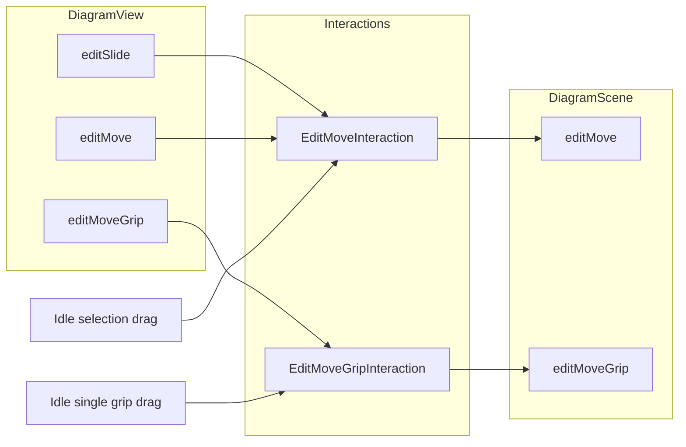

# Edit move / grip split

## Goal

1. **Unmovable items** (gate pins) cannot move via selection drag, grip drag, or commit.
2. **One item-move interaction** with connectivity (today’s `DiagramMoveInteraction`), named `EditMoveInteraction`.
3. **Grip drag as a special case** — single grip only, dedicated view/scene API and interaction.

## Done

### `movable()`

- [`ItemMoveMixin.movable()`](ConnectEd/widgets/graphics/items/mixin/move.py) defaults to `True`.
- [`GatePinItem.movable()`](ConnectEd/widgets/graphics/items/gate_pin.py) → `False`; ORIGIN uses `FixedGripItem`; `moveHandleBy` raises.
- [`FixedGripItem`](ConnectEd/widgets/graphics/items/grip.py) — `movable()` → `False`, empty context menu (still subclasses `MoveGripItem`).

### Idle / scene

- Idle: only start grip interactions when `grip.movable()` (avoids the `FixedGripItem`/`MoveGripItem` isinstance trap).
- [`DiagramScene.editMove`](ConnectEd/widgets/graphics/scenes/diagram/api/edit.py) filters with `movable()` and `topParentItem() not in items` before `CmdMove`.
- View `_editMove` no longer does parent filtering (thinned to start an interaction only).

### Still split today (pre-rename)

| Path | Interaction | Notes |
|------|-------------|--------|
| Idle selection drag | `DiagramMoveInteraction` | Connectivity / rubber |
| Menu Slide/Move, `_editMove` | Thin `EditMoveInteraction` | No rubber; uses `moveBy` |
| Idle / menu grip | Thin `EditMoveInteraction` | Passes grip; misuses `slide=isinstance(ResizeGripItem)` |

## Target architecture



| API | Interaction | Commit |
|-----|-------------|--------|
| `editSlide` / `editMove` | `EditMoveInteraction` (rename of `DiagramMoveInteraction`) | `scene.editMove` |
| `editMoveGrip` | `EditMoveGripInteraction` (narrowed thin path) | `scene.editMoveGrip` |

**Drop `_editMove`** — it only picks slide vs move state and starts the thin interaction. After the rename, `editSlide` / `editMove` start `EditMoveInteraction` directly:

```python
def editSlide(self, items, pos=None):
    ...
    host.state.interact(
        EditMoveInteraction(host, items, pos, slide=True),
        host.stateEditSlide,
    )

def editMove(self, items, pos):
    ...
    host.state.interact(
        EditMoveInteraction(host, items, pos, slide=False),
        host.stateEditMove,
    )
```

## Remaining work

### 1. Preview / scene filter hardening (movable)

- In the **item** move interaction init: skip `not movable()`; if nothing left, do not start (or no-op `valid()`).
- Scene `editMove`: replace `topParentItem() not in items` with any-ancestor-in-set (same walk as today’s thin interaction); return early when `filtered_items` is empty; `ItemMixin` already implies `ItemMoveMixin`.

### 2. Rename item move

- `DiagramMoveInteraction` → `EditMoveInteraction` (keep in `interaction/move.py` or move beside other edit interactions).
- Call sites: idle selection drag; later `editSlide` / `editMove`; `tests/scratch_xor_move.py`; `doc/MOVE.md` names.

### 3. Grip path

- Thin class → `EditMoveGripInteraction(view, grip, pos)` — single `GripItem`, preview via `moveBy` / `moveSave`/`moveRestore`.
- `DiagramView.editResize` → `editMoveGrip`; `stateEditResize` → `stateEditMoveGrip`.
- `DiagramScene.editMoveGrip(grip, offset, undoable=...)` + `CmdMoveGrip` — must **not** use `CmdMove` / `ItemMixin` filter; apply grip `moveBy` (→ `moveHandleBy`) with undo state from `moveSave`.
- Idle: `EditMoveGripInteraction` only; drop the bogus `slide=isinstance(ResizeGripItem)` argument.
- `ResizeGripItem` menu: keep label “Resize” if desired; call `editMoveGrip`.

### 4. Wire menus / remove helper

- Context Slide/Move → `editSlide` / `editMove` → new `EditMoveInteraction`.
- Delete `_editMove`.
- `MoveGripItem` Slide/Move actions stay on the **parent item** via `editSlide`/`editMove` (not `editMoveGrip`).

## Out of scope (optional later)

- Resolve `MoveGripItem` → parent item and run full `EditMoveInteraction` (rubber for origin-grip drag).
- Resize + net rubber when handle edits change attached pin positions.
- Host-narrowing helpers (`asDiagramView` etc.) — separate completed track.

## Related

- Connectivity commit details: [doc/MOVE.md](MOVE.md)
- Gate pin note in [doc/NEXT.md](NEXT.md)
