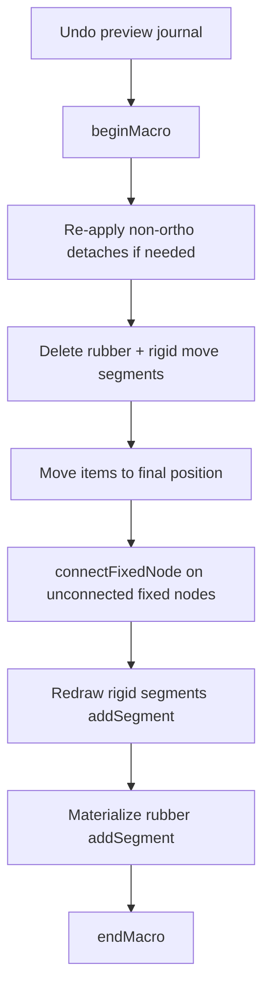

# MOVE Plan

## Goal

Diagram moves detach mobile fixed nodes from foreign connectivity, preview safely, and on commit:

1. Apply final geometry
2. **`connectFixedNode`** on unconnected pins/taps at drop positions (landing merge/split/zero-length)
3. **Redraw** ortho connectivity only (rigid moved segments + rubber materialization)

Non-ortho boundary wires cannot rubber-band: **detach and leave in place** (free node at old attach point).

## Architecture

### Layer responsibilities

| Layer | Role |
|-------|------|
| **Netlist** | Graph/subnet only (`replaceSegmentNode`, `addSegment`, `removeSegment`, …) |
| **Commands** | Orchestrate netlist + scene items + `onConnectionChanged()` on affected nodes |
| **API** (`conn.py`) | Conditional logic; dispatch commands/macros |
| **`connectFixedNode`** | Post-drop landing for **unconnected** `FixedNodeItem` only |

### `connectFixedNode` contract

Runs when `node.degree() == 0` at final `scenePos()`:

- Merge colocated `FreeNodeItem` → pin (`replaceSegmentNode` per segment)
- Pin-to-pin zero-length segment
- Split crossing `SegmentItem` at pin
- Cull orphaned free nodes from scene after merge

**Not** responsible for parallel-edge collapse (guarded by unconnected-only).

### Commit order (diagram move and block pin)



**Why `connectFixedNode` before redraw:** After delete + move, ortho pins are degree-0. Landing hits (free node, crossing wire, colocated pin) are resolved before rubber/rigid `addSegment` legs attach. If redraw ran first, pins would already be connected and `connectFixedNode` would no-op.

Preview journal is always unwound (`_cancel` / stack index 0) before the real macro; commit re-applies detaches as undoable commands.

### Boundary segment policy (move init)

| Segment type | Mobile/static | Policy |
|--------------|---------------|--------|
| Ortho, 1 mobile / 1 static, static degree > 1 | slide | Rubberize |
| Ortho, 1 mobile / 1 static, static degree > 1 | Alt (no slide) | Float static side + move segment |
| **Non-ortho**, attached to mobile fixed node | either | **Float from mobile** — wire stays at old attach point |
| Both endpoints mobile | — | Rigid move (delete + recreate in commit) |

### Pin-bearing items (move init)

`TapItem | PortItem | GateItem | BlockItem | SymbolItem` — scan fixed nodes, apply policy above.

**Done:** `PortItem` and `TapItem` included in fixed-node scan ([move.py](ConnectEd/widgets/graphics/views/diagram/interaction/move.py)).

### Block pin slide (separate interaction)

[DiagramEditMoveBlockPinsInteraction](ConnectEd/widgets/graphics/views/diagram/interaction/edit.py):

- **Init:** private undo stack; `detachFixedNode` for each pin (preview float from pin node)
- **Preview:** `setLoc` only; wires hang from old edge position
- **Cancel:** restore loc + stack index 0
- **Commit:** undo preview → macro: detach (real) → `editMoveBlockPins` → `connectFixedNode` per pin

## Current state

| Item | Status |
|------|--------|
| `connectFixedNode` | Implemented; needs `degree()==0` guard, orphan free-node removal |
| `CmdReplaceSegmentNode` + `netlist.replaceSegmentNode` | Graph + graphics retarget |
| `DiagramMoveInteraction` Port/Tap scan | Done |
| Non-ortho float/detach | Not implemented (ortho-only rubberize; non-ortho still rigid) |
| Move commit `connectFixedNode` pass | Not wired |
| Block pin detach/connect | Not wired |
| `addSegment` zero-length early return | Leaks undo macro when `undoable=True` |

## Steps to finishing line

### 1. Close out connectivity primitives

- [conn.py](ConnectEd/widgets/graphics/scenes/diagram/api/conn.py): `if node.degree() > 0: return` at top of `connectFixedNode`
- After free-node merge loop: remove orphan `FreeNodeItem` from scene (no segments, not in graph)
- [conn.py](ConnectEd/widgets/graphics/scenes/diagram/api/conn.py): fix `addSegment` zero-length path to `endMacro` or call `CmdAddSegment` directly
- [conn.py](ConnectEd/widgets/graphics/scenes/diagram/cmd/conn.py): `CmdReplaceSegmentNode` — refresh **both** endpoints in redo/undo

### 2. Shared detach helper

Add to [conn.py](ConnectEd/widgets/graphics/scenes/diagram/api/conn.py) (or move preview cmd):

```python
def detachFixedNode(node: FixedNodeItem, undoable: bool = False) -> list[FreeNodeItem]:
    """Float every segment off node; return replacement free nodes (one per segment)."""
```

Uses `CmdDetachSegmentNode` in preview (private undo stack) and commit macro.

### 3. Non-ortho in `DiagramMoveInteraction.__init__`

In `_processFixedNode`, replace silent skip for `not seg.isOrthogonal()`:

```python
if seg not in item_set:
    if seg.isOrthogonal() and self._slide:
        self._rubber(seg, node)
    elif not seg.isOrthogonal():
        self._float(seg, node)  # preview; track for commit if needed
```

Track `_floated_nonortho: list[SegmentItem]` if commit must re-detach after preview unwind.

### 4. Wire `DiagramMoveInteraction._commit`

After `editMove`, before rigid/rubber redraw:

```python
for node in self._movedFixedNodes(items):  # helper collects tap/port/pin nodes
    self._scene.connectFixedNode(node, undoable=True)
```

Helper: walk moved `PortItem`, `TapItem`, `GateItem`, `BlockItem`, `SymbolItem` in final item set.

Re-apply non-ortho detaches inside macro if preview floats were undone by `_cancel()`.

### 5. Block pin interaction

Mirror move pattern in [edit.py](ConnectEd/widgets/graphics/views/diagram/interaction/edit.py):

- `_undo_stack` on init
- Push preview float per pin segment
- `_cancel`: restore + stack index 0
- `_commit`: preview restore → undo stack → macro(detach, `editMoveBlockPins`, `connectFixedNode` × pins)

### 6. Tests and manual validation

- Unconnected port placed on wire → split + connected
- Port on free node → merge
- Two colocated pins → zero-length
- Block pin slide onto junction → detach preview, connect on commit
- Cancel after detach restores wires
- Move block with ortho rubber → landing on foreign net via connectFixedNode + rubber
- Non-ortho wire stays at old attach point after move

## Out of scope (later)

- Primary-selection unification across drawing/diagram entry points
- Paste/duplicate `connectFixedNode` pass
- Zero-length removal when pins separate (`disconnectZeroLengthBetween`)
- Full MOVE.md preview hooks `detachEntry` / `dropSegmentNode` naming (superseded by `detachFixedNode` + `connectFixedNode`)

## Key files

- [ConnectEd/widgets/graphics/scenes/diagram/api/conn.py](ConnectEd/widgets/graphics/scenes/diagram/api/conn.py)
- [ConnectEd/widgets/graphics/scenes/diagram/cmd/conn.py](ConnectEd/widgets/graphics/scenes/diagram/cmd/conn.py)
- [ConnectEd/widgets/graphics/scenes/diagram/netlist.py](ConnectEd/widgets/graphics/scenes/diagram/netlist.py)
- [ConnectEd/widgets/graphics/views/diagram/interaction/move.py](ConnectEd/widgets/graphics/views/diagram/interaction/move.py)
- [ConnectEd/widgets/graphics/views/diagram/interaction/edit.py](ConnectEd/widgets/graphics/views/diagram/interaction/edit.py)
