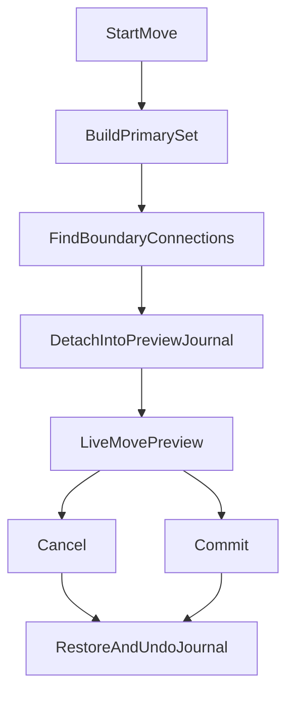

# MOVE Plan

## Goal
Implement connectivity-aware non-slide movement for diagram items so preview movement can temporarily detach selected connectivity from unselected neighbors, cancel can restore the original state safely, and commit can rebuild the dropped connectivity deterministically.

## Key Decisions
- Keep generic movement in [ConnectEd/widgets/graphics/scenes/drawing/cmd/__init__.py](ConnectEd/widgets/graphics/scenes/drawing/cmd/__init__.py) unchanged; diagram-specific connectivity behavior belongs in the diagram layer.
- Use one shared primary-selection helper for all move entry points so gesture-started and UI-started moves select the same effective item set.
- Use a private preview journal for temporary detach operations instead of trying to hand-code exact detach/attach symmetry.
- On commit, restore preview state first, unwind the preview journal, then run one real scene undo macro from the original state.

## Current Constraints
- [ConnectEd/widgets/graphics/views/drawing/state/idle.py](ConnectEd/widgets/graphics/views/drawing/state/idle.py), [ConnectEd/widgets/graphics/views/drawing/ui/edit.py](ConnectEd/widgets/graphics/views/drawing/ui/edit.py), and [ConnectEd/widgets/graphics/views/drawing/interaction/edit.py](ConnectEd/widgets/graphics/views/drawing/interaction/edit.py) currently normalize move selections differently.
- [ConnectEd/widgets/graphics/scenes/diagram/netlist.py](ConnectEd/widgets/graphics/scenes/diagram/netlist.py) still has node-refactor inconsistencies in `removeEdge()`, `degree()`, and edge-query helpers that must be fixed before movement logic can rely on them.
- [ConnectEd/widgets/graphics/scenes/diagram/api/conn.py](ConnectEd/widgets/graphics/scenes/diagram/api/conn.py) already contains the intended preview hooks: `detachEntry()`, `detachSegment()`, and `dropSegmentNode()`, but they are still stubs.
- [ConnectEd/widgets/graphics/scenes/diagram/api/__init__.py](ConnectEd/widgets/graphics/scenes/diagram/api/__init__.py) currently does not include the diagram edit mixin, so diagram-specific move handling will need explicit routing.

## Implementation Stages

### 1. Unify Primary Selection
Create one helper that removes any selected item whose ancestor is also selected.

Use it from:
- [ConnectEd/widgets/graphics/views/drawing/state/idle.py](ConnectEd/widgets/graphics/views/drawing/state/idle.py)
- [ConnectEd/widgets/graphics/views/drawing/ui/edit.py](ConnectEd/widgets/graphics/views/drawing/ui/edit.py)
- [ConnectEd/widgets/graphics/views/drawing/interaction/edit.py](ConnectEd/widgets/graphics/views/drawing/interaction/edit.py)

Rules:
- Final primaries may include top-level items, free `VertexItem`s, and `SegmentItem`s.
- `EntryItem`s move as part of selected owner items unless explicitly selected alone.
- Parented helper graphics should not survive into the primary move set when an ancestor is already selected.

### 2. Stabilize Node / Netlist Primitives
Fix the node-based netlist API so movement code has reliable graph operations.

Target areas:
- [ConnectEd/widgets/graphics/scenes/diagram/netlist.py](ConnectEd/widgets/graphics/scenes/diagram/netlist.py)
- [ConnectEd/widgets/graphics/items/node.py](ConnectEd/widgets/graphics/items/node.py)
- [ConnectEd/widgets/graphics/items/segment.py](ConnectEd/widgets/graphics/items/segment.py)
- [ConnectEd/widgets/graphics/scenes/diagram/cmd/conn.py](ConnectEd/widgets/graphics/scenes/diagram/cmd/conn.py)

Specific fixes:
- Correct variable mismatches introduced by the node refactor.
- Ensure `NodeItem.segments()` matches the netlist helper actually provided.
- Finish or temporarily bypass incomplete split helpers that would break preview detach or commit rebuild.
- Update segment endpoint typing to `NodeItem` where the refactor now expects nodes, not only vertices.

### 3. Add Preview Detach Journal
Extend the move interaction with a private preview journal that records temporary structural edits.

Preview flow:

Implement preview helpers in [ConnectEd/widgets/graphics/scenes/diagram/api/conn.py](ConnectEd/widgets/graphics/scenes/diagram/api/conn.py):
- `detachEntry()`
- `detachSegment()`
- `dropSegmentNode()`

Boundary rule:
- Selected side keeps its identity.
- Unselected side gets a replacement stationary free vertex when needed.
- Zero-length entry-entry segments are treated as derived artifacts and can be deleted during preview detach.

### 4. Implement Deterministic Commit Macro
After restoring preview state, execute one diagram-specific move macro from the original scene state.

Commit sequence:
- Move selected non-connectivity owners by the final offset.
- Reconnect moved entries against existing entries, vertices, and crossed segments at the drop position.
- Ensure node existence at moved free-vertex positions with `getNode()`.
- Rebuild or retarget selected segments from their dropped endpoints.
- Normalize the result by removing redundant free vertices, splitting crossed segments, and recreating or removing zero-length entry-entry segments as needed.

### 5. Route Diagram Moves Through Diagram Logic
Ensure diagram scenes use diagram-aware move processing rather than the generic drawing move implementation.

Likely touchpoints:
- [ConnectEd/widgets/graphics/scenes/diagram/api/__init__.py](ConnectEd/widgets/graphics/scenes/diagram/api/__init__.py)
- [ConnectEd/widgets/graphics/scenes/diagram/api/edit.py](ConnectEd/widgets/graphics/scenes/diagram/api/edit.py)
- [ConnectEd/widgets/graphics/views/drawing/interaction/edit.py](ConnectEd/widgets/graphics/views/drawing/interaction/edit.py)

## Special Cases
- Moving a selected segment endpoint away from an unselected entry should leave the entry behind and create a replacement free vertex for the stationary side.
- Moving a selected free vertex that still supports unselected segments should leave stationary connectivity behind via a replacement free vertex.
- Zero-length segments joining colocated entries should be created or deleted automatically based on the final dropped geometry.

## Validation
- Manual checks for cancel after detach preview.
- Manual checks for commit after moving selected segments only.
- Manual checks for commit after moving owner items with entries.
- Regression checks for plain drawing-scene move behavior outside diagrams.
- Targeted lint pass on all touched files after implementation.

## Initial File Focus
- [ConnectEd/widgets/graphics/views/drawing/state/idle.py](ConnectEd/widgets/graphics/views/drawing/state/idle.py)
- [ConnectEd/widgets/graphics/views/drawing/ui/edit.py](ConnectEd/widgets/graphics/views/drawing/ui/edit.py)
- [ConnectEd/widgets/graphics/views/drawing/interaction/edit.py](ConnectEd/widgets/graphics/views/drawing/interaction/edit.py)
- [ConnectEd/widgets/graphics/scenes/diagram/api/conn.py](ConnectEd/widgets/graphics/scenes/diagram/api/conn.py)
- [ConnectEd/widgets/graphics/scenes/diagram/api/edit.py](ConnectEd/widgets/graphics/scenes/diagram/api/edit.py)
- [ConnectEd/widgets/graphics/scenes/diagram/netlist.py](ConnectEd/widgets/graphics/scenes/diagram/netlist.py)
- [ConnectEd/widgets/graphics/scenes/diagram/cmd/conn.py](ConnectEd/widgets/graphics/scenes/diagram/cmd/conn.py)
- [ConnectEd/widgets/graphics/items/segment.py](ConnectEd/widgets/graphics/items/segment.py)

## Execution Order
1. Unify primary-selection handling.
2. Repair node/netlist primitives.
3. Add preview detach journal support.
4. Implement diagram-specific commit rebuild macro.
5. Validate special cases and regressions.
