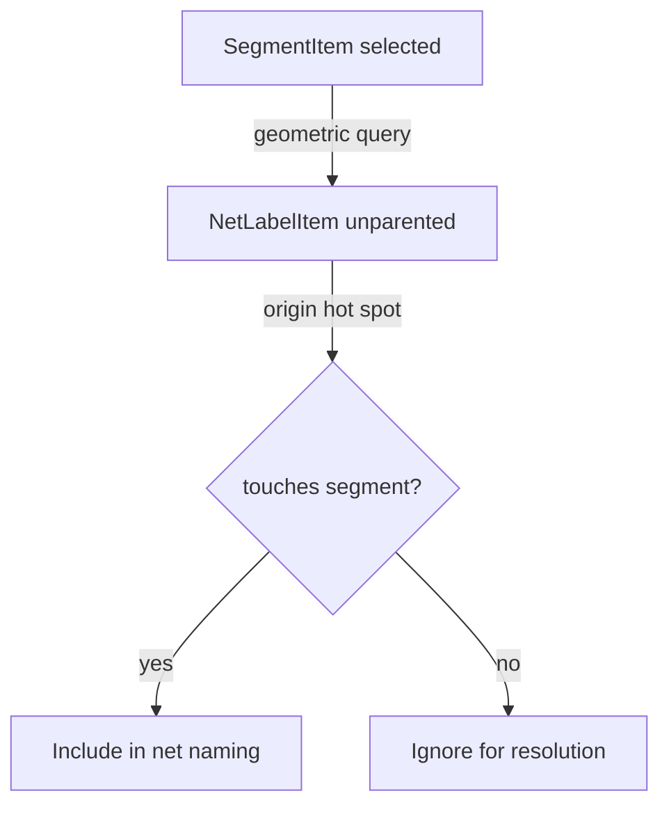

# Net labels

Implementation plan for floating `NetLabelItem` on diagram sheets. Replaces the
legacy model (labels parented to `FreeNodeItem`) with unparented text items whose
**origin handle** is the wire attachment hotspot.

## Design

### What changed from the earlier sketch

| Earlier idea | Current direction |
|--------------|-------------------|
| Structurally bound to `SegmentItem` (`_segment`, `_t`) | **Unparented** top-level item; no segment reference stored |
| Container + `PropertyTextItem` child | **Single item** — cousin of `PropertyTextItem`, not parent/child |
| Label follows segment on geometry change | Label **does not move** when the wire moves; touch is **recomputed** |
| Cleat/tether to segment handle | **Origin** (`RectHandleId`) is the hotspot; text offset like any `TextItem` |

### Participation rule

A label contributes to net name resolution **only if** its origin
(`getOriginHandle().scenePos()`) geometrically **touches** a segment — point on
the **finite** segment within tolerance. Moving the label or changing origin can
attach or detach without editing the wire.

### Selection rule

Selecting a **segment** finds coincident `NetLabelItem`s (origin touches that
segment) and **propagates selection** to them. No parent/child link to the
segment.

### Segment delete

Labels are **not** auto-deleted when a segment is removed. They may become
non-touching and drop out of resolution until the user repositions them.



## Current state

- [`net_label.py`](../ConnectEd/widgets/graphics/items/net_label.py) — floating `TextItem` subclass with Name/Value, origin hotspot, context menu, `_notifyNetlist()` (guarded until §3).
- [`NetLabelItemDialog`](../ConnectEd/widgets/dialogs/items/net_label.py) + placement flow — Place menu working; commit via `addItems` / `CmdAdd`.
- Top-level `<NetLabel>` save/load — registered in [`items/__init__.py`](../ConnectEd/widgets/graphics/items/__init__.py); post-load refresh in [`ItemXmlMixin.fromXml`](../ConnectEd/widgets/graphics/items/mixin/xml.py).
- [`editDelete`](../ConnectEd/widgets/graphics/scenes/diagram/api/edit.py) — top-level labels delete via `super().editDelete()` (was blocked by property-text exception; diagram path also never called super for other items).
- Legacy labels under [`FreeNodeItem`](../ConnectEd/widgets/graphics/items/node.py); netlist still scans `node.childItems()` in [`netlist.py`](../ConnectEd/widgets/graphics/scenes/diagram/netlist.py).
- Orphan free-node cleanup still deletes child labels in [`conn.py`](../ConnectEd/widgets/graphics/scenes/diagram/api/conn.py).
- `FreeNodeItem.fromXml` parent/child bug: `instance.setParentItem(child)` should be `child.setParentItem(instance)`.

## Target: `NetLabelItem`

**Base:** extend [`TextItem`](../ConnectEd/widgets/graphics/items/text.py) (transform,
rect handles, resize grips, appearance) — **not** `PropertiesMixin` +
`PropertyTextSpec`.

**Why not `PropertyTextItem`:** cleat/tether and `owner().properties` are for
labels bound to a parent item. Net labels are free-floating.

| Feature | Approach |
|---------|----------|
| Name + displayed text | `_name`, `_value`; `onTextChanged()` → `value` or `"<{_name}>"` |
| Properties | `InherentProperty` for **Name** and **Value** (MVP); optional **Visible** later |
| Padding | Include `TextItem._PROPERTIES_PADDING` in `_PROPERTIES` |
| Origin | `ItemRectHandlesMixin`; origin point = hotspot |
| Hot spot visibility | `_ORIGIN_GRIP_SHAPE = GripShape.STAR` on origin handle; shown when selected via `setGripsVisible` (same as other rect-handle text items). **No** custom `paint()` or extra resource. |
| Text body | `NetLabel` theme quill |
| Direct `text()` / `setText()` | Block like `PropertyTextItem`; edit via properties / dialogs |

**Do not use:** segment registry, cleat-to-segment, `_PROPERTY_TEXTS`,
`NetLabelTetherItem`.

### `__init__` (fill existing signature, do not rewrite)

Call `super().__init__(...)`, set `_name` / `_value`, `onTextChanged()`.
Default `_name` for net naming labels is `"Name"` (matches legacy
`child.name() == "Name"` checks).

Implement `settingsName() → "NetLabel"`.

Set `_ORIGIN_GRIP_SHAPE = GripShape.STAR` (class attribute). Do **not** override
`paint()` or clear `ItemHasNoContents` — `TextItem` renders via its child
renderer; the origin grip marks the hotspot when the item is selected.

## Netlist: touch geometry and resolution

Touch helpers live on [`Netlist`](../ConnectEd/widgets/graphics/scenes/diagram/netlist.py),
not in a separate items module. Views and items call `scene.netlist.*`.

**Staged rollout:** stage **2** adds placement (Place menu, interaction, XML) using the
**existing view snap** (`DrawingView._snap`) — no wire-specific snap on `Netlist`.
Stage **3+** adds touch geometry, resolution, change handlers, and the rest of the
public API. `_notifyNetlist()` on `NetLabelItem` stays a no-op until `onNetLabelChanged`
lands in stage 3.

**Why not `items/net_label_touch.py`:** avoids a freestanding geometry module
that would pull `Netlist` / `DiagramScene` and segment graph concerns into
`items/`. Keeping touch tests beside `_resolveSubnet` keeps “does this label
name this net?” in one place.

**Do not** put touch logic on `NetLabelItem` — the item only notifies the
netlist when its geometry or value changes (effective from stage 3).

### Constants and primitives (module-level or `Netlist` private)

```python
_TOUCH_EPS = PITCH / 2   # core.defs

def _segmentSceneLine(seg: SegmentItem) -> QLineF
def _originScenePos(label: NetLabelItem) -> QPointF
def _segmentTouchesOrigin(seg, origin, eps=_TOUCH_EPS) -> bool
```

- Segment in scene coords: `seg.scenePos()` → `seg.mapToScene(seg.line().p2())`.
- Project origin onto segment; require parameter `t ∈ [0, 1]` and distance ≤ `eps`.
- **Stage 3+:** implement primitives and public methods below; drive resolution
  and selection.

### Public `Netlist` methods

**Stage 3+ (resolution and selection):**

```python
def netLabels(self) -> list[NetLabelItem]
def labelsTouchingSegment(self, seg: SegmentItem) -> list[NetLabelItem]
def labelsTouchingSubnet(self, nodes: set[NodeItem]) -> list[NetLabelItem]
def subnetsForLabel(self, label: NetLabelItem) -> set[Subnet]
def subnetsForSegment(self, seg: SegmentItem) -> set[Subnet]
def onNetLabelChanged(self, label: NetLabelItem) -> None
def onSegmentGeometryChanged(self, seg: SegmentItem) -> None
```

- `onNetLabelChanged` / `onSegmentGeometryChanged` — `_resolveSubnets(affected)`,
  then `self._scene.netlistChanged.emit()` (**stage 3+**).

### Resolution changes (stage 3+)

In `_resolveSubnet` / `nodeNameSuffixType`:

1. Remove `FreeNodeItem.childItems()` / `NetLabelItem` scans.
2. Collect name labels via `labelsTouchingSubnet(subnet.nodes)`; filter
   `label.name() == "Name"`; append `label.value()` to `label_names`.
3. Precedence unchanged (name labels over port names; conflicts → DRC later).

**On segment geometry change:** do not move labels; call `onSegmentGeometryChanged`.
**On label move / origin / value change:** `NetLabelItem` calls `onNetLabelChanged`.

Remove label deletion from orphan free-node cleanup in
[`conn.py`](../ConnectEd/widgets/graphics/scenes/diagram/api/conn.py).

## Selection: segment → coincident labels (stage 6)

Hook in [`DrawingView._selectClick`](../ConnectEd/widgets/graphics/views/drawing/private.py)
after selecting a `SegmentItem`:

1. If segment is selected, `labels = scene.netlist.labelsTouchingSegment(seg)`.
2. For each label, apply the same fresh / shift / ctrl policy as the segment
   click (`setSelected(True)` or toggle).

**Move/slide (MVP):** segment move does **not** move touching labels (no
structural bind). Optional later: move touching labels with selected segment.

## Placement undo (stage 2 — done)

Placement uses the same path as Place Text:

- [`PlaceNetLabelInteraction`](../ConnectEd/widgets/graphics/views/diagram/interaction/place.py) — empty subclass of `PlaceBase1PosInteraction`.
- **Commit:** `scene.addItems([item], undoable=True)` → [`CmdAdd`](../ConnectEd/widgets/graphics/scenes/drawing/cmd/__init__.py).

No dedicated scene API (`addNetLabel`, etc.) — deferred.

### `editDelete`

In [`diagram/api/edit.py`](../ConnectEd/widgets/graphics/scenes/diagram/api/edit.py),
remove `NetLabelItem` from the property-text parent exception — top-level labels
delete via `super().editDelete()` like other unparented items.

## XML (new format only, stage 2)

Top-level `<NetLabel>` element (via `ItemXmlMixin` + property attrs):

- Scene position (`X`, `Y`), text layout, `Origin`, **Name**, **Value**.
- **No** `SegmentID` / `T`.

Register `NetLabelItem` in
[`items/__init__.py`](../ConnectEd/widgets/graphics/items/__init__.py). Scene
[`toXml` / `fromXml`](../ConnectEd/widgets/graphics/scenes/diagram/__init__.py)
already serialises unparented `ItemXmlMixin` items.

Strip NetLabel child XML from
[`node.py`](../ConnectEd/widgets/graphics/items/node.py) (`toXml`, `fromXml`).

No migration for old FreeNode-embedded labels.

## Place menu and placement flow (stage 2)

Primary UX: **Place → Net Label** on diagram sheets (alongside Connection, Tap,
etc.). Secondary: segment context menu **Add Net Label** (same commit path).

### Menu bar

| File | Change |
|------|--------|
| [`menu_bar/actions.py`](../ConnectEd/widgets/window/menu_bar/actions.py) | `Action(..., "Net Label", "Place Net Label", shortcut TBD)` e.g. `placeNetLabel` |
| [`menu_bar/slots.py`](../ConnectEd/widgets/window/menu_bar/slots.py) | `@withCurrentWidget(DiagramView) def placeNetLabel(...): view.ui.placeNetLabel()` |
| [`menu_bar/__init__.py`](../ConnectEd/widgets/window/menu_bar/__init__.py) | In `updatePlaceMenu`, diagram branch: add `placeNetLabel` after `placeTap` (connectivity group) |

### View UI

[`views/diagram/ui/place.py`](../ConnectEd/widgets/graphics/views/diagram/ui/place.py):

```python
def placeNetLabel(self) -> None:
    self._view.state.go(self._view.statePlaceNetLabel)
```

### View state

[`views/diagram/state/__init__.py`](../ConnectEd/widgets/graphics/views/diagram/state/__init__.py):

- Declare and construct `statePlaceNetLabel`.

[`views/diagram/state/place.py`](../ConnectEd/widgets/graphics/views/diagram/state/place.py):

- `DiagramViewStatePlaceNetLabel` — status e.g. `"Place Net Label: pick a position"`.
- On **entry:** open [`NetLabelItemDialog`](../ConnectEd/widgets/dialogs/items/net_label.py)
  (mirror `DrawingViewStatePlaceText` + `TextItemDialog`); **Value** has focus.
- On dialog OK: apply name/value and layout fields to preview item; start
  `PlaceNetLabelInteraction` at `_snap` position.
- On dialog Cancel: return to idle.

### Placement interaction

New [`PlaceNetLabelInteraction`](../ConnectEd/widgets/graphics/views/diagram/interaction/place.py)
(subclass `PlaceBase1PosInteraction` or `Interaction`):

- Preview `NetLabelItem` following cursor at `view._snap(pos)` (existing grid snap).
- **Commit:** `scene.addItems([item], undoable=True)`.
- **Cancel:** remove preview.

### Snap

Placement uses the **existing view snap** (`DrawingView._snap`), same as Place Text.
Wire touch geometry on `Netlist` is **not** required for stage 2.

## Segment context menu (secondary, stage 2)

[`SegmentItem`](../ConnectEd/widgets/graphics/items/segment.py) — `ctxMenuItems` for diagram scenes:

- **Add Net Label** — dialog then immediate drop (no placement interaction). Snap the context-menu point; locate the wire attach with `perpendicularIntersection` — perpendicular projection onto the segment, clamped to the nearer endpoint when the foot lies beyond either end (H/V and diagonal segments).

## `NetLabelItem` UI on existing item

Override `ctxMenuItems` (cousin of `PropertyTextItem` / `TextItem`):

- **Properties...** → `editItemProperties` (edit **Name** / **Value**).
- **Appearance...** → `editAppearance`.
- Auto width/height actions as for text items.

**Origin hotspot:** `_ORIGIN_GRIP_SHAPE = GripShape.STAR` (already on
[`net_label.py`](../ConnectEd/widgets/graphics/items/net_label.py)). When
selected, the origin handle’s star grip (`MoveGripItem` via
[`grip.py`](../ConnectEd/widgets/graphics/items/grip.py) `origin_shape`) is
visible through the normal `setGripsVisible` path — no `paint()` override.

## TODO checklist

Work in order unless noted. Check off as completed.

### 1. `NetLabelItem` — `items/net_label.py`

Do this first. Item should be constructable before placement lands in §2.

- [x] Add `TextItem._PROPERTIES_PADDING` to `_PROPERTIES`.
- [x] Implement `__init__` body: `super().__init__(...)`, `_name`, `_value`, `onTextChanged()` (keep existing signature).
- [x] Implement `settingsName() → "NetLabel"`.
- [x] `_ORIGIN_GRIP_SHAPE = GripShape.STAR` for origin hotspot when selected (no custom `paint()`).
- [x] Block direct `text()` / `setText()` (raise like `PropertyTextItem`).
- [x] Wire `setName` / `setValue` to call `_notifyNetlist()` after `onTextChanged()`.
- [x] Override `onPositionChanged` — call super, then `_notifyNetlist()`.
- [x] Override `setOrigin` — call super, then `_notifyNetlist()`.
- [x] `_notifyNetlist()` — if scene is `DiagramScene`, call `scene.netlist.onNetLabelChanged(self)` (guard until §3 exists).
- [x] Override `ctxMenuItems` — Properties, Appearance, auto width/height (cousin of `PropertyTextItem`).

### 2. Place net labels

Goal: place, edit, save, and reload labels on wires. **No net naming yet**
(`_notifyNetlist` remains a no-op).

**Placement dialog — `widgets/dialogs/`:**

- [x] [`items/net_label.py`](../ConnectEd/widgets/dialogs/items/net_label.py) — `NetLabelItemDialog` (extends `BaseTextItemDialog`).
- [x] `NetLabelItemGroupBox` + `NetLabelItemLayout` — Name (editable combo: Name, Type; Name default) and Value (**focus on open**).

**Delete and XML:**

- [x] `scenes/diagram/api/edit.py` — remove `NetLabelItem` from property-text parent delete exception; `super().editDelete()` for non-segment items.
- [x] `items/__init__.py` — `registerClass(_item_classes, "NetLabelItem")`.
- [x] `items/mixin/xml.py` — `_fromXmlRefresh()` after attrs/children (`onTextChanged`, `onSceneRotationChange`).
- [x] Programmatic round-trip: top-level `<NetLabel Name=… Value=…>` save/load; delete via `editDelete`.
- [ ] Manual round-trip: save design with label, reload in app, verify attrs.

**Place menu — window / view wiring:**

- [x] `menu_bar/actions.py` — `placeNetLabel` action.
- [x] `menu_bar/slots.py` — `placeNetLabel(view)` → `view.ui.placeNetLabel()`.
- [x] `menu_bar/__init__.py` — add to diagram branch of `updatePlaceMenu` (after `placeTap`).
- [x] `views/diagram/ui/place.py` — `placeNetLabel()` → `state.go(statePlaceNetLabel)`.
- [x] `views/diagram/state/__init__.py` — declare and construct `statePlaceNetLabel`.
- [x] `views/diagram/state/place.py` — `DiagramViewStatePlaceNetLabel` (dialog on entry, interaction on OK).

**Place interaction — `views/diagram/interaction/place.py`:**

- [x] `PlaceNetLabelInteraction` — `PlaceBase1PosInteraction` subclass; commit via `addItems`.

**Segment context menu — `items/segment.py`:**

- [x] Implement `ctxMenuItems(view)` for diagram scenes.
- [x] Action **Add Net Label** — dialog + direct drop; origin at perpendicular foot of snapped menu point on segment.

**Stage 2 verification:**

- [x] Place → Net Label; label appears at snapped grid position.
- [ ] Set **Value** via Properties; displayed text updates (netlist unchanged).
- [x] Undo/redo add/remove label.
- [x] Delete selected top-level label (via `editDelete` → `CmdDelete`).
- [ ] Save/load preserves top-level `<NetLabel>` elements (manual app test).
- [x] Segment context menu **Add Net Label** works.
- [x] Right-click existing label: Properties / Appearance.

### 3. Netlist resolution — `scenes/diagram/netlist.py`

**Touch geometry and public API:**

- [ ] `_TOUCH_EPS = PITCH / 2`.
- [ ] `_segmentSceneLine(seg)` — scene-space finite segment from `scenePos()` + `line().p2()`.
- [ ] `_segmentTouchesOrigin(seg, origin, eps)` — project onto segment; require `t ∈ [0, 1]` and distance ≤ `eps`.
- [ ] `_originScenePos(label)` — `label.getOriginHandle().scenePos()`.
- [ ] `netLabels()` — all top-level `NetLabelItem` in `self._scene`.
- [ ] `labelsTouchingSegment(seg)` — filter `netLabels()` by `_segmentTouchesOrigin`.
- [ ] `labelsTouchingSubnet(nodes)` — in-subnet segments only; dedupe labels.
- [ ] `subnetsForLabel(label)` — subnets of segments touched by label origin.
- [ ] `subnetsForSegment(seg)` — subnets of `node1` / `node2`.
- [ ] `onNetLabelChanged(label)` — `_resolveSubnets(subnetsForLabel(label))`, `netlistChanged.emit()`.
- [ ] `onSegmentGeometryChanged(seg)` — `_resolveSubnets(subnetsForSegment(seg))`, `netlistChanged.emit()`.

**Resolution (replace legacy scans):**

- [ ] Remove `FreeNodeItem` / `NetLabelItem` child scan from `nodeNameSuffixType`.
- [ ] In `_resolveSubnet`, replace per-node `childItems()` loop with `labelsTouchingSubnet(subnet.nodes)`.
- [ ] Keep filter `label.name() == "Name"`; append `label.value()` to `label_names`.
- [ ] Verify name-label precedence over port/pin names unchanged in existing resolution logic.

**Wire commands and item notifications:**

- [ ] Hook netlist refresh into add/delete undo (§3+; may extend `CmdAdd` / `CmdDelete` or add wrapper).
- [ ] Confirm `_notifyNetlist()` on `NetLabelItem` drives resolution.

- [ ] (Optional) Unit tests for `_segmentTouchesOrigin` edge cases.

### 4. Segment geometry hook — `items/segment.py`

- [ ] At end of `onGeometryChange`, if scene is `DiagramScene`, call `netlist.onSegmentGeometryChanged(self)`.

### 5. Legacy removal

- [ ] `items/node.py` — remove NetLabel child serialisation from `NodeItem.toXml`.
- [ ] `items/node.py` — remove NetLabel child deserialisation from `FreeNodeItem.fromXml`.
- [ ] `scenes/diagram/api/conn.py` — remove NetLabel deletion loop in orphan free-node cleanup.

### 6. Selection propagation — `views/drawing/private.py`

- [ ] After `_selectItem(items[0])` in `_selectClick`, if item is `SegmentItem` and selected:
- [ ]   Guard: scene is `DiagramScene`.
- [ ]   For each label in `scene.netlist.labelsTouchingSegment(seg)`, apply fresh / ctrl-toggle selection policy.
- [ ] Confirm shift-add-to-selection behaviour matches segment click (no accidental clear).

### 7. End-to-end verification

- [ ] Set **Value** via Properties; netlist browser / subnet name updates.
- [ ] Move label off wire; name drops from net resolution.
- [ ] Move label back onto wire; name reappears.
- [ ] Select segment; touching labels become selected.
- [ ] Delete segment; label remains but no longer names the net.
- [ ] Undo/redo add label restores/removes net name correctly.

### 8. Docs follow-up (post-implementation)

- [ ] Update [`CONNECTIVITY2.md`](CONNECTIVITY2.md) — floating label model (remove FreeNode parent wording).
- [ ] Tick “implement net labels” in [`NEXT.md`](NEXT.md) or add cross-link to this doc.

## Implementation order (summary)

1. §1 `NetLabelItem` — done.
2. §2 **Place net labels** — placement + delete/XML done; segment menu + manual save/load verify remain.
3. §3 **Netlist resolution** — touch API, `_resolveSubnet`, wire `onNetLabelChanged`.
4. §4 Segment geometry hook.
5. §5 Legacy removal (FreeNode child XML, conn cleanup).
6. §6 Selection propagation.
7. §7 End-to-end verification (net naming + selection).
8. §8 Docs follow-up.

## Out of scope (for now)

- Type / Visible / `_net_names` type codes.
- DRC for conflicts or floating labels not touching any segment.
- Old FreeNode XML migration.
- Auto-moving labels when segment slides.
- Properties spreadsheet columns for net labels.

## Related docs

- [`CONNECTIVITY2.md`](CONNECTIVITY2.md) — net naming overview (update when implemented).
- [`NEXT.md`](NEXT.md) — name-label precedence notes.
