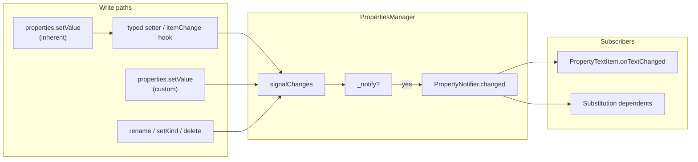

# Properties system

Canonical reference for ConnectEd's properties system: XML serialization,
tabular/dialog editing, custom properties, substitution (`{OtherProp}`), and
**PropertyTextItem** display on diagram items.

## Overview

[`properties.py`](../ConnectEd/widgets/graphics/properties.py) defines the
properties layer used by scenes and graphics items. It supports:

- **Serialization** — read/write property values as XML attributes.
- **Tabular editing** — properties spreadsheets and item dialogs.
- **Custom properties** — user-defined runtime properties on any
  `PropertiesMixin` owner.
- **Substitution** — custom string values may reference other properties via
  `{PropertyName}`.
- **Display** — `PropertyTextItem` children show bound property values on the
  sheet, with layout from [`PropertyTextSpec`](../ConnectEd/widgets/graphics/items/property_text.py).

### Property kinds

| Kind | Defined on | Renamable | Deleted | Typical use |
|------|------------|-----------|---------|-------------|
| **InherentProperty** | Class `_PROPERTIES` dict | No | No | Schema fields: X, Y, Name, Label, … |
| **CustomProperty** | Added at runtime | Yes | Yes | User annotations; kind STR/TEXT/INT/FLOAT/BOOL |

Default label placement for inherent properties is declared per item class in
`_PROPERTY_TEXTS`. At construction (`fresh=True`), `PropertiesManager` converts
each spec to a `PropertyTextItem` via `addText`.

[`NetLabelItem`](../ConnectEd/widgets/graphics/items/net_label.py) is a
free-floating `TextItem` with its own Name/Value properties (no default
`_PROPERTY_TEXTS`); see [`NET_LABEL.md`](NET_LABEL.md) for netlist behaviour.

## Data model

### InherentProperty / CustomProperty

| Field | Role |
|-------|------|
| `kind` | `DataKind` or callable returning kind |
| `getter` / `setter` | Read/write on owner; inherent setter should delegate to a typed front door |
| `worthy` | Include in XML when truthy (inherent only) |
| `notifier` | Per-instance `PropertyNotifier`; created lazily when something subscribes via `value(name, slot)` |
| `text` | Bound `PropertyTextItem`, if any |

### PropertyTextSpec

Layout and appearance only — **not** line vs block format (that follows property
**kind**; renderer sync not yet implemented).

### PropertiesManager API

| Method | Purpose |
|--------|---------|
| `value(name, slot=None, trail=None)` | Get value; optional slot subscribes to changes |
| `setValue(name, value)` | Inherent: call setter only; custom: assign + `signalChanges` |
| `init(name, value)` | Deserialization; uses `setValue` (silent while `_notify` is false) |
| `setKind` / `rename` / `delete` | Custom property lifecycle; each calls `signalChanges` when applicable |
| `setNotify(bool)` | Enable/disable all signalling (construction and XML load) |
| `signalChanges(names)` | Emit `changed` on subscribed notifiers (gated by `_notify`) |
| `addText` / `editText` / `delText` / … | PropertyTextItem management |

Owners mix in [`PropertiesMixin`](../ConnectEd/widgets/graphics/properties.py)
and call `initProperties(fresh)` during construction.

## Notification model (current)

### Design rule

> **Front doors signal; the manager routes writes.**

| Write path | Who notifies? |
|------------|---------------|
| **Inherent property** | Typed setter or Qt `itemChange` hook calls `self.properties.signalChanges(name)` |
| **`properties.setValue`** (inherent) | Delegates to inherent setter → front door signals |
| **`properties.setValue`** (custom) | Manager `signalChanges` after assign |
| **`rename` / `setKind` / `delete`** | Manager `signalChanges` |
| **Load / construction** | Suppressed via `_notify=False`; batch refresh at end of load where needed |

Notifiers are **lazy** (created on first `value(name, slot)` subscription). No
always-on notifiers — properties nothing listens to need no notifier object.

### `_notify` lifecycle

| Phase | `_notify` |
|-------|-----------|
| `PropertiesManager.__init__` | `False` |
| End of `initItem` / `DrawingScene.__init__` | `setNotify(fresh)` — `True` for normal construction |
| XML / clone / `fresh=False` build | Stays `False` until load completes |
| After `fromXml`, clone, `DiagramScene.fromXml`, etc. | `setNotify(True)` — `# enable property change signalling` |

[`initItem`](../ConnectEd/widgets/graphics/items/mixin/__init__.py) initialises
the properties system **first**, then other mixins, so front doors exist before
transform init runs.

### Flow



### Qt-backed geometry

X/Y, Rotation, MirrorH/MirrorV signal from [`ItemChangeMixin`](../ConnectEd/widgets/graphics/items/mixin/change.py)
hooks (`onPositionChanged`, `onRotationChanged`, `onMirrorChange`) and from
`setOrigin` — not from `setValue` directly.

### What emits today

| Operation | Emits? | Notes |
|-----------|--------|-------|
| Inherent `setValue` | Via front door | Manager does not emit |
| Custom `setValue` | Yes | `signalChanges(name)` |
| `delete` | Yes | Before key removed |
| `rename` | Yes | `signalChanges(new_name)` after key move |
| `setKind` | Yes | `signalChanges(name)` |
| `signalChanges` | If `_notify` and notifier exists | Single gate for all paths |

### Remaining propagation gaps

| Change type | Status |
|-------------|--------|
| **Value** | Reliable when front door calls `signalChanges` |
| **Kind** | Emits; PropertyTextItem line/block renderer synced from kind |
| **Rename** | Emits on new key; `PropertyTextItem._name` synced; `{OldName}` updated on same owner |

## Write paths and brittleness

### Intended pattern

```python
def setName(self, value: str) -> None:
    self._name = value
    self._bus = ":" in value
    ...  # side effects
    self.properties.signalChanges("Name")

"Name": InherentProperty(
    getter=lambda self: self.name(),
    setter=lambda self, value: self.setName(value),
),
```

`properties.setValue("Name", v)` → `setName(v)` → one notify site.

For load-only silent writes (optional `_apply*` without signal), use paths where
`_notify` is false, or internal helpers never exposed as inherent setters.

## Checklist

Work roughly in order. Check off as completed. Uses ☐ (todo) and ☑ (done) —
visible in the built-in Markdown preview (which does not render GFM `- [ ]` /
`- [x]` as checkboxes).

### 0. Manager and infrastructure

- ☑ Inherent setters delegate to typed methods (no bare `setattr` in `_PROPERTIES`) for port pin, part, symbol instance Label, drawing scene Name
- ☑ Inherent `setValue` does not emit; custom `setValue`, `delete`, `rename`, and `setKind` use `signalChanges`
- ☑ `_notify` / `setNotify` gating; init/load lifecycle; `signalPropertyChanges` removed — use `properties.signalChanges`

### 1. Front-door signalling audit

Add `self.properties.signalChanges("<PropertyName>")` to every inherent front door not yet covered. Use exact names from `_PROPERTIES`.

- ☑ Transform hooks — X/Y, Rotation, MirrorH/MirrorV, Origin
- ☑ [`port_pin.py`](../ConnectEd/widgets/graphics/items/port_pin.py) — Name, Dir, Comment
- ☑ [`text.py`](../ConnectEd/widgets/graphics/items/text.py) — Block, AutoFlip, Text, AlignH/V, Width, Height, Pad Left/Right/Top/Bottom
- ☑ [`part.py`](../ConnectEd/widgets/graphics/items/part.py) — Label, Name, Path
- ☑ [`symbol_instance.py`](../ConnectEd/widgets/graphics/items/symbol_instance.py) — Label
- ☑ [`gate.py`](../ConnectEd/widgets/graphics/items/gate.py) — Label; Output / Input(s)
- ☑ [`tap.py`](../ConnectEd/widgets/graphics/items/tap.py) — Suffix
- ☑ [`port_pin.py`](../ConnectEd/widgets/graphics/items/port_pin.py) — Dot, Clock
- ☑ [`polyline.py`](../ConnectEd/widgets/graphics/items/polyline.py) — Closed
- ☑ [`loc.py`](../ConnectEd/widgets/graphics/items/mixin/loc.py) — Edge, Offset
- ☑ [`line.py`](../ConnectEd/widgets/graphics/items/line.py) — X1, Y1, X2, Y2
- ☑ [`base_rect.py`](../ConnectEd/widgets/graphics/items/base_rect.py) — Width, Height
- ☑ Presentation mixins — Line Color/Width/Style, Fill Color/Style, Text Color/Font/Size/Bold/Italic/Underline
- ☑ [`drawing/__init__.py`](../ConnectEd/widgets/graphics/scenes/drawing/__init__.py) — Name
- ☑ [`diagram/__init__.py`](../ConnectEd/widgets/graphics/scenes/diagram/__init__.py) — Sheet Name, Sheet Width, Sheet Height, Margin, Border
- ☑ [`net_label.py`](../ConnectEd/widgets/graphics/items/net_label.py) — Name, Value
- ☑ [`property_text.py`](../ConnectEd/widgets/graphics/items/property_text.py) — Name, Visible, Cleat

### 2. Rename and kind propagation

- ☑ `rename`: update bound `PropertyTextItem._name`; revisit `{OldName}` substitution
- ☑ `setKind`: sync PropertyTextItem line/block renderer from kind
- ☑ `CmdEditProperty` / undo: rename keeps text item identity consistent

### 3. Guardrails and tests

- ☐ Lint or review rule: inherent setter must delegate to typed front door
- ☐ Lint or review rule: typed front door (non-Qt) must call `signalChanges`
- ☐ Integration test: PropertyTextItem refreshes via `setValue` and direct setter
- ☐ Integration test: rename and kind change propagate correctly

### 4. Docs and related cleanup

- ☐ Trim or update [`NEXT.md`](NEXT.md) top note on properties propagation (superseded by this doc)
- ☐ Cross-link dock-widget / mirroring notes in NEXT where relevant

## PropertyTextItem

[`PropertyTextItem`](../ConnectEd/widgets/graphics/items/property_text.py) displays
the bound owner property via `owner().properties.value(name, onTextChanged)`.

Line vs block format follows property **kind** (`STR` → line, `TEXT` → block); synced
via `PropertiesManager.setKind` / `addText` / `setText`.

### Editing paths

| Path | Entry |
|------|-------|
| Property text dialog | `applyDialog` — may `rename`, `setKind`, `setValue`, `setCleat` |
| Item properties | `editProperty` + `CmdEditProperty` |
| Layout/appearance | `editPropertyText` + `CmdEditPropertyText` |

Rename via `applyDialog` or `CmdEditProperty` updates `PropertyTextItem._name`
through `PropertiesManager.rename`.

## Serialization and commands

- XML: [`toXmlAttrs` / `fromXmlAttrs`](../ConnectEd/core/xml.py) over
  `properties.names()` + `worthy`; load uses `init()` while `_notify` is false.
- Undo: [`cmd/edit/properties.py`](../ConnectEd/widgets/graphics/scenes/drawing/cmd/edit/properties.py).
- Scene API: [`DrawingSceneApiPropertiesMixin`](../ConnectEd/widgets/graphics/scenes/drawing/api/properties.py).

`CmdEditProperty.redo` order: `rename` → `setKind` → `setValue`.

## PropertyTextItem inventory

| Item class | Default labels |
|------------|----------------|
| [`BlockItem`](../ConnectEd/widgets/graphics/items/block.py) | Label, Name |
| [`SymbolInstanceItem`](../ConnectEd/widgets/graphics/items/symbol_instance.py) | Label, Name |
| [`PortItem`](../ConnectEd/widgets/graphics/items/port.py) | Name |
| [`BlockPinItem`](../ConnectEd/widgets/graphics/items/block_pin.py) | Name |
| [`SymbolPinItem`](../ConnectEd/widgets/graphics/items/symbol_pin.py) | Name |
| [`TapItem`](../ConnectEd/widgets/graphics/items/tap.py) | Suffix |

No default `_PROPERTY_TEXTS`: gates, gate pins, net labels.

## Contributing — property setters

When adding or fixing inherent properties:

1. **Getter/setter** — delegate to typed `name()` / `setName()` (no bare
   `setattr` in `_PROPERTIES`).
2. **Front door** — apply field + side effects, then
   `self.properties.signalChanges("Name")`.
3. **Qt geometry** — signal from `itemChange` hook or `setOrigin`, not duplicated
   in `setValue`.
4. **Custom properties** — use manager `setValue` / `setKind` / `rename`; do not
   bypass the manager.
5. **Construction / XML** — rely on `_notify=False` during init/load; enable with
   `setNotify(True)` when the object is ready; use `_fromXmlRefresh` or equivalent
   for batch display sync where needed.

Optional `_apply*` helpers are for shared mutation without signal (internal load
only) — not required when `_notify` gating covers construction.

## Related docs

- [`NET_LABEL.md`](NET_LABEL.md) — floating net labels.
- [`NEXT.md`](NEXT.md) — broader backlog.
