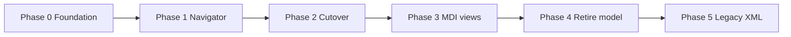

# ConnectEd refactor — consolidated plan

Single plan for the ongoing migration: **Session**, **Doc**, **symbols**, **Navigator**, **MDI**, **closure**, and **XML**. Supersedes former **CLOSE** and **SYMBOLS** notes (removed). Partial overlap with [`SESSION.md`](SESSION.md) — treat **this file** as the active checklist; SESSION remains background reference until trimmed.

**Also related:** [`NEXT.md`](NEXT.md) (broader backlog), [`SCRIPTING.md`](SCRIPTING.md).

Use checkboxes to track progress. Work may proceed phase-by-phase or task-by-task.

---

## Executive summary

| Track | Outcome |
|-------|---------|
| **Session** | Owns open documents, load/save/close, registry, signals — replaces global **`model()`** for document lifecycle |
| **Doc** | Persistent domain per file type (`SchematicDoc`, `LibraryDoc`, …) in **`ConnectEd/documents/`** |
| **Symbols** | Cache masters + sheet instances; transient **`SymbolScene`** for edit; clone → commit on **Save** |
| **Navigator** | Document-agnostic tree from Session + **`NavItemSpec`**; **`DocBinding`** on items |
| **MDI** | **`DocSubWindow`** + **`DocBinding(doc, subject)`**; doc owns open/focus |
| **Close** | Editor vs document close; primary-or-last-window policy |
| **XML** | Slurp-based load, symbol definition/instance split, retire **`core/xml.py`** for graphics |

**Still running in parallel:** legacy **`model()`** + **`navigator_old/`** (not wired in main window; new **`navigator/`** is active but incomplete).

---

## State of play (code today)

| Area | Status |
|------|--------|
| [`Session`](../ConnectEd/core/session.py) | Registry, `new`/`load`/`save`/`saveAs`/`close`, `openDocs`, **`docChanged`** signal; **`docTypeForDoc`** via class lookup; path not always set on load/new; no path normalisation; no **`docClosed`** / **`docOpened`** |
| [`Doc` ABC](../ConnectEd/core/doc.py) | Persistence template; **`NavItemSpec`** (WIP, duplicate `label`, stale `open` on ABC); **`DocBinding`**; broken pasted code in **`open()`** abstract method |
| [`SchematicDoc`](../ConnectEd/documents/schematic.py) | Path, `fromXml`/`toXml`; **`openWindow`** with **`DocBinding`** + symbol **clone**; **`openDefault`** still abstract; nav specs stale (`navigatorChildren`, `DocNavKind`, `symbolDefinitions`) |
| [`LibraryDoc`](../ConnectEd/documents/library.py) | Stub |
| [`Navigator`](../ConnectEd/widgets/window/navigator/) | New tree: L1 groups, `_addDoc`, file New/Open/Save/Close API; **`NavModel`** not synced to Session on startup; no double-click open; no `docChanged` listener; **`fileClose`** policy written but **`closeDocument`**, **`_otherSubwindows`**, **`isPrimarySubject`** not implemented |
| [`DocSubWindow`](../ConnectEd/widgets/window/sub_window.py) | **`docBinding()`** → **`DocBinding`** |
| [`DrawingSubWindow`](../ConnectEd/widgets/graphics/views/drawing/__init__.py) | Constructor still typed as `doc: Doc`; schematic passes **`DocBinding`** positionally — works at runtime |
| Menu **File → Save/Close** | [`@withCurrentSubWindow`](../ConnectEd/widgets/window/menu_bar/slots.py) → Navigator; Save does not **`commitEditor`** for symbols yet |
| **MDI titles** | Still **`model().getDbNodeFromScene`** in [`mdi_area.py`](../ConnectEd/widgets/window/mdi_area.py) |
| **Legacy `Model`** | Still in [`core/db.py`](../ConnectEd/core/db.py), [`app.py`](../ConnectEd/app.py), [`main.py`](../ConnectEd/main.py); **`navigator_old/`** still uses it |

---

## Architecture

### Layering

```text
Session                    — open docs, registry, save/load/close, signals
  Doc (ABC)                — persistence, nav specs, open/rename/close/commit
    SchematicDoc / LibraryDoc / …
  Navigator (TreeView)     — document-agnostic UI; DocBinding on items
  DocSubWindow + views     — transient editors; DocBinding(doc, subject)
```

**Dependency rule:** **`core`** does not import **`widgets`**; **`documents`** may import both.

### Code layout

```text
ConnectEd/
  core/
    doc.py          # Doc ABC, NavItemSpec, DocBinding
    session.py      # Session, DocType
  documents/
    schematic.py    # SchematicDoc
    library.py      # LibraryDoc
    fsm.py          # future
  widgets/window/
    navigator/      # new Navigator (active)
    navigator_old/  # legacy — delete after cutover
doc/                # markdown only (this file)
```

### Session

| Responsibility | API / notes |
|----------------|-------------|
| Open documents | `_open_docs: list[Doc]`; consider `dict[Doc, DocType]` or **`docTypeForDoc(doc)`** (class lookup today) |
| Registry | **`DocType`**: `name`, `group`, `ext`, `tag`, `cls`; **`registerDocType`** keyed by XML **`tag`** |
| New | **`session().new(tag)`** |
| Load | **`session().load(path)`** — dedup via **`openDocForPath`**; set **`doc.setPath`** on success |
| Save | **`session().save(doc)`** / **`saveAs(doc, path)`** |
| Close | **`session().close(doc)`** — emit **`docClosed`** (TODO) |
| Change broadcast | **`docChanged(Doc)`** — Navigator/MDI refresh labels, rebuild symbol subtree |
| Not on Session | Qt model indices, tree shape details |

### Doc

A **`Doc`** is persistent session data — not an MDI window, not a Navigator row, not necessarily a scene.

| Area | Target API |
|------|------------|
| Persistence | `path`, `setPath`, `toXml`, `fromXml`; template **`save()`** on ABC |
| Display | **`displayName()`** / **`setDisplayName()`** — L2 row text |
| Navigator children | **`navChildSpecs()`** → tree under L2 |
| Rename | **`rename(subject, name)`** — dispatch on subject type (`DiagramScene`, `SymbolItem`, …) |
| Open | **`open(subject)`** / **`openDefault()`** → **`openWindow`** / MDI |
| Primary subject | **`isPrimarySubject(widget)`** — for close policy |
| Symbol commit | **`commitEditor(subwindow)`** — clone → master on Save |
| Notify | **`onChanged()`** → **`session().onDocChanged(self)`** |

### DocBinding

Stored on **`DocSubWindow`** and Navigator **`UserRole`**:

```python
@dataclass
class DocBinding:
    doc    : Doc
    widget : QWidget | None   # None on L2 nav row only; else DiagramScene, SymbolItem, …
```

- **Subwindow:** `widget` = edit subject (cache master for symbol editors, **`DiagramScene`** for diagram).
- **Navigator L2 row:** `DocBinding(doc, None)` — rename/open use doc-level hooks.
- **Navigator child row:** `DocBinding(doc, subject)` — symbol master, not **`NavItemSpec`**.

Navigator calls **`doc.rename(binding.widget, text)`** and **`doc.open(binding.widget)`** — no string ids in Navigator.

### NavItemSpec

Spec for building Navigator rows under a document (not stored on subwindows):

```python
@dataclass
class NavItemSpec:
    label       : str | Callable[[], str]
    subject     : object | None              # None => folder row (Symbols container)
    editable    : bool = True
    child_specs : list[NavItemSpec] | None = None
```

| `subject` | Row role |
|-----------|----------|
| **`None`**, not editable | Container (e.g. **Symbols** folder) — expand only |
| **`SymbolItem`**, etc. | Editable entry — double-click → **`doc.open(subject)`** |
| Dynamic labels | Callable **`label`** re-evaluated on **`docChanged`** |

**L2 document row** is **not** in **`navChildSpecs()`** — built by Navigator from **`doc.displayName()`**, tooltip **`doc.path() or "(not saved)"`**.

**Agreed tree (schematic):**

```text
Schematic Diagrams                 (L1 — DocType.group)
  CPU Board                          (L2 — displayName(); dbl-click → openDefault())
    Symbols                          (L3 — container, subject=None, not editable)
      ALU                            (L4 — subject=cache SymbolItem)
      Reset
```

### Opening editors

**Doc** owns MDI assembly (not Navigator):

```text
doc.open(subject) / openDefault()
  → scan mdi for DocSubWindow with DocBinding(doc, subject)
  → if found: activate
  → else: create view + DocSubWindow(DocBinding), addSubWindow, showMaximized
```

Optional shared helper: **`documents/editor.py`** (`focus_or_create`).

---

## Symbols

### Model (agreed)

**Old idea:** definition as items permanently in **`SymbolScene`**; instances from scene content.

**New model:**

| Concept | Detail |
|---------|--------|
| **Structure** | **`SymbolItem`**: empty rectangle; border visible when editing; **pins** as children on border (**EdgeLoc**); **graphics** as children inside border |
| **Definition (master)** | Held in **symbol cache** — **`DiagramScene._symbols`** dict and/or **`LibraryDoc`** symbol list — **not** a placed sheet item |
| **Sheet instance** | Clone of master; back-ref to cache entry by name/id |
| **Master ↔ instances** | Forward/back refs so edits (or library replacement) propagate; followed by **connectivity refresh** |
| **Libraries** | Containers of symbols + **metadata** (VHDL / Verilog library names) |
| **`SymbolScene`** | **Transient** — created only for symbol **editing**; may subclass **`DiagramScene`** |

### Editing workflow

1. **Open** symbol from Navigator → clone master into new **`SymbolScene`** → **`SymbolView`** in **`DocSubWindow`**.
2. **Edit** clone freely (undo on editor scene).
3. **Save** → **`doc.commitEditor(subwindow)`** applies clone → cache master → propagate instances → **`session().save(doc)`**.
4. **Close editor** (non-document path) → discard clone; master unchanged.
5. **No doc registry** for transient scenes — locate via **`subwindow.docBinding()`** → view → scene → clone.

### Serialisation (XML)

| Rule | Detail |
|------|--------|
| **Definitions block** | When serialising diagram (or paste), symbol **definitions** in separate **Symbols** block before other items |
| **Collisions** | Paste may collide with existing cache names — resolve on paste |
| **`SymbolItem.toXml`** | Two paths: **definition** (pins + graphics) vs **instance** (reference to master) |
| **`SymbolItem.fromXml`** | **`fromXmlDefinition(xr)`**; **`fromXmlInstance(master, xr)`** |
| **Order** | Serialise symbol definitions **before** other items ([`NEXT.md`](NEXT.md)) |

### Implementation tasks (symbols)

- [ ] Finalise **`SymbolItem`** geometry, pins, graphics children
- [ ] **`SymbolItem._cloneAfter`** — full definition subtree for editor clone
- [ ] **`SchematicDoc.commitEditor(subwindow)`** — clone → master, instance refresh, netlist
- [ ] **`DiagramScene._symbols`**, **`symbols()`**, add/remove/rename API
- [ ] **`navChildSpecs()`** — Symbols container + one row per cache entry (**`subject=master`**)
- [ ] Instance **`fromXmlInstance` / `toXmlInstance`**
- [ ] Definition **`fromXmlDefinition` / `toXmlDefinition`**
- [ ] Paste/import collision handling
- [ ] Connectivity refresh after master change

---

## Navigator

### Principles

- **Document-agnostic** — only **`Doc`**, **`DocBinding`**, **`NavItemSpec`** at boundary.
- **Session** is signal bus — no Navigator callbacks registered on **`Doc`**.
- **Do not** query **`mdi_area`** for reuse from Navigator — call **`doc.open`**.

### Current new Navigator ([`navigator/__init__.py`](../ConnectEd/widgets/window/navigator/__init__.py))

- [x] L1 group rows from **`session().docTypes()`**
- [x] **`_addDoc`** — L2 + recursive **`navChildSpecs()`**
- [x] **`onItemChanged`** → **`doc.rename(widget, text)`** (needs **`rename`** on Doc)
- [ ] Connect **`session().docChanged`** — refresh L2 text, re-call label callables, rebuild Symbols subtree
- [ ] **`session().docClosed`** — remove L2 row
- [ ] Populate tree from **`session().openDocs()`** on startup
- [ ] Double-click / Enter: L2 → **`openDefault()`**; container → expand; child → **`doc.open(subject)`**
- [ ] Fix child **`UserRole`**: store **`DocBinding(doc, subject)`** not **`DocBinding(doc, NavItemSpec)`**
- [ ] Context menus (New symbol, Close doc, …) — port from **`navigator_old`**
- [ ] Inline rename suppress flag — avoid echo **`onItemChanged`** when updating from **`docChanged`**

### Navigator API ([`navigator/api.py`](../ConnectEd/widgets/window/navigator/api.py))

| Method | Target behaviour |
|--------|------------------|
| **`docLoad` / `fileOpen` / `fileNew`** | Session + **`_addDoc`** |
| **`fileSave(subwindow)`** | **`commitEditor`** if symbol → **`docSave`** |
| **`fileSaveAs(subwindow)`** | Dialog → **`docSaveAs`** |
| **`fileClose(subwindow)`** | Close policy (see Closure) |
| **`docClose(doc)`** | Used by **`closeDocument`** only |
| **`closeDocument(doc)`** | TODO — MDI sweep + Session + tree |

---

## MDI and menu bar

### DocSubWindow

- [x] **`DocBinding`** on subwindow
- [ ] **`closeEvent`** → same path as **`Navigator.fileClose`** (with prompt)
- [ ] **`DrawingSubWindow(parent, doc_binding=...)`** — fix constructor signature

### MdiArea

- [ ] Window titles from **`docBinding.doc.displayName()`** + editor kind (diagram / symbol name)
- [ ] Remove **`model().getDbNodeFromScene`**
- [ ] **`closeDocument`** listener or inline sweep

### Menu bar ([`menu_bar/slots.py`](../ConnectEd/widgets/window/menu_bar/slots.py))

- [x] **`@withCurrentSubWindow`** for File Save / Save As / Close
- [ ] **`fileSave`** → **`commitEditor`** before save when symbol editor active
- [ ] Enable **`fileClose`** when active subwindow present
- [ ] Fix **`withCurrentWidget`** — use **`activeSubWindow()`** not **`currentSubWindow()`**
- [ ] Update **Close** action tooltip

---

## Closure

### Two kinds of close

| Kind | Session | Navigator L2 | MDI |
|------|---------|--------------|-----|
| **Close editor** | Doc stays | Stays | One subwindow |
| **Close document** | **`session().close(doc)`** | Row removed | **All** subwindows for doc |

### Policy (agreed)

**Full document close** when **either**:

1. **Primary editor** — **`doc.isPrimarySubject(binding.widget)`** (schematic: **`DiagramScene`**; library: **`LibraryDoc`** / library root — see Libraries), **or**
2. **Last subwindow** — no other **`DocSubWindow`** for same **`doc`** after this one closes.

**Otherwise:** **`subwindow.close()`** only (symbol editor → discard clone).

```text
Close symbol editor, diagram still open     → editor only
Close diagram editor (L2)                   → close document
Close symbol editor, only window left       → close document
```

### closeDocument(doc)

```text
closeDocument(doc)
  → _closeSubwindowsForDoc(doc)     # all DocSubWindow with binding.doc == doc
  → session().close(doc)            # emit docClosed
  → _removeDocFromTree(doc)
```

**Order:** MDI first, then Session, then Navigator.

### Closure checklist (8 steps)

1. [ ] **`DocBinding`** correct everywhere (schematic **`openWindow`** largely done; verify **`DrawingSubWindow`**)
2. [ ] **`isPrimarySubject`** on Doc ABC + **`SchematicDoc`** (+ **`LibraryDoc`** later)
3. [ ] **`_otherSubwindows`**, **`closeDocument`**, wire **`fileClose`** (policy sketched in api — methods missing)
4. [ ] **`_removeDocFromTree`** or **`docClosed`** listener
5. [ ] Save/discard prompts (document + dirty symbol clone)
6. [ ] Menu Close and subwindow **X** → same **`fileClose`** path
7. [ ] Menu/actions polish (enable Close, tooltips, non-**`DocSubWindow`** → **`close()`**)
8. [ ] **`Session.docClosed`** signal

### Libraries — primary editor required

**`LibraryDoc`** has no diagram. Without a primary subwindow, File → Close on a symbol editor only closes the editor; there is no explicit “close library” except last-window rule.

**Agreed:** **`LibrarySubWindow`** — L2 / **`openDefault()`** target:

| | Schematic | Library |
|---|-----------|---------|
| Primary subject | **`DiagramScene`** | **`LibraryDoc`** (or root widget) |
| Primary window | **`DiagramSubWindow`** | **`LibrarySubWindow`** (new) |
| Secondary | Symbol editors | Symbol editors (same clone model) |
| Close primary | Close document | Close document |

**`LibrarySubWindow`** (initial): VHDL / Verilog library name fields; optional symbol list (Navigator already lists symbols).

```python
DocBinding(library_doc, library_doc)
LibraryDoc.isPrimarySubject(widget) → widget is self
LibraryDoc.openDefault() → open/focus LibrarySubWindow
```

---

## XML refactor

From [`NEXT.md`](NEXT.md) — in scope for this migration where it touches documents/symbols.

| Task | Detail |
|------|--------|
| **XML slurping** | Simplify **`fromXml`** — read subtree into structure, then construct |
| **Scene/item XML** | Tidy new approach under **`widgets/graphics`** |
| **Retire `core/xml.py` for graphics** | XML is a graphics concern; Session uses doc envelope only |
| **Symbol serialisation order** | Definitions before instances/other items |
| **`SymbolItem` dual paths** | **`toXmlDefinition` / `toXmlInstance`**, **`fromXmlDefinition` / `fromXmlInstance`** |
| **Segment paste** | **`SegmentPreviewItem`** → **`scene.addSegment`**; prove connectivity cut/paste |
| **Envelope** | **`SchematicDoc.toXml`** aligned with **`saveBegin`/`saveEnd`** ([`core/xml.py`](../ConnectEd/core/xml.py)) |
| **Legacy `.dsn` / `<Design>`** | Adapter or migration to **`.sch` / `<Schematic>`** (Phase 5) |

---

## Phased delivery



### Phase 0 — Session + Doc foundation

- [x] **`Doc` ABC**, **`documents/`** package, **`Session`** skeleton
- [x] **`docChanged`** signal
- [x] **`DocBinding`**, **`DocSubWindow`**
- [ ] Clean **`Doc.open()`** ABC — remove pasted legacy code from [`doc.py`](../ConnectEd/core/doc.py)
- [ ] Finalise **`NavItemSpec`** (drop duplicate fields, **`subject`** not **`id`/`open` callables**)
- [ ] **`SchematicDoc`**: scene on **`new`**, **`setPath`** on load, **`displayName`** from sheet, **`openDefault`**, **`rename`**, **`isPrimarySubject`**, **`commitEditor`**
- [ ] Register **`SchematicDoc`** only from **`documents/schematic.py`**; remove broken registry from [`diagram/__init__.py`](../ConnectEd/widgets/graphics/scenes/diagram/__init__.py)
- [ ] **`session().load`** → **`doc.setPath(path)`**; path normalisation
- [ ] Scene **`setName`** → **`doc.onChanged()`** with suppress flag for Navigator-driven renames
- [ ] Unit tests: registry, save, **`docChanged`**

**Exit:** `session().new("Schematic")` + save; schematic **`openWindow`** opens diagram MDI with valid **`DocBinding`**.

### Phase 1 — Navigator complete

- [ ] Fix nav item **`UserRole`** subjects on child rows
- [ ] **`docChanged` / `docClosed`** listeners
- [ ] Startup sync from **`openDocs()`**
- [ ] Double-click / keyboard open
- [ ] **`closeDocument`**, **`_removeDocFromTree`**, working **`fileClose`**
- [ ] **`fileSave`** + **`commitEditor`**

**Exit:** File New/Open/Save/Close for schematic without **`model()`** in navigator code.

### Phase 2 — Symbol cache + XML (core)

- [ ] Symbol cache on **`DiagramScene`**, **`navChildSpecs`**, symbol open/close/save
- [ ] **`SymbolItem`** definition/instance XML
- [ ] Slurp refactor for diagram load (incremental)

**Exit:** Create/edit/save symbol definition on schematic; instances on sheet.

### Phase 3 — MDI + menu polish

- [ ] MDI titles from **`DocBinding`**
- [ ] Close prompts; **`closeEvent`** unified
- [ ] **`LibraryDoc`** stub + **`LibrarySubWindow`**

**Exit:** No **`getDbNodeFromScene`** in MDI; library open/close policy defined.

### Phase 4 — Retire global `Model`

- [ ] Remove **`model()`** from app/main
- [ ] Delete or gut **`core/db.py` **`Model`**
- [ ] Delete **`navigator_old/`**
- [ ] Update tests, CLI, GUI validators
- [ ] Grep gate: no app-level **`model()`** in navigator / mdi / menu_bar

**Exit:** Session is sole document service.

### Phase 5 — Legacy and cleanup

- [ ] **`.dsn` / `<Design>`** migration
- [ ] Drop **`DesignDbNode` / `LibraryDbNode` / `SymbolNode`**
- [ ] Full **`LibraryDoc`** persistence
- [ ] Retire **`core/xml.py`** for graphics per NEXT

---

## Migration map (`model()` → Session)

| Today | Target |
|-------|--------|
| `model().load(path)` | `session().load(path)` + Navigator **`_addDoc`** |
| `model().newDesignDbNode()` | `session().new("Schematic")` + **`openDefault()`** |
| `model().newLibraryDbNode()` | `session().new("Library")` + **`openDefault()`** |
| `model().close(node)` | **`closeDocument(doc)`** |
| `model().getDbNodeFromScene(scene)` | **`subwindow.docBinding()`** / **`doc.open`** |
| `navigator().save(scene)` | **`navigator().fileSave(subwindow)`** + **`commitEditor`** |
| `navigator().close(scene)` | **`navigator().fileClose(subwindow)`** |
| `_editDrawing(node)` | **`doc.open(subject)`** |
| Tree **`itemChanged`** on db nodes | **`docChanged`** + **`DocBinding`** |

---

## Files checklist

| Area | Files |
|------|-------|
| Session | `ConnectEd/core/session.py` |
| Doc | `ConnectEd/core/doc.py` |
| Documents | `ConnectEd/documents/schematic.py`, `library.py` |
| Navigator | `ConnectEd/widgets/window/navigator/__init__.py`, `api.py` |
| Subwindow / MDI | `sub_window.py`, `mdi_area.py`, `views/drawing/__init__.py`, `views/symbol.py` |
| Menu | `menu_bar/slots.py`, `menu_bar/actions.py` |
| Scenes / symbols | `scenes/diagram/`, `items/symbol.py`, `scenes/symbol/` |
| Legacy (remove) | `core/db.py`, `navigator_old/` |
| Tests | `tests/integration/`, `tests/unit/` |

---

## Test plan

| Area | Check |
|------|-------|
| Session | Registry; **`docChanged`** / **`docClosed`**; path on load; save |
| Navigator | Groups + L2 + Symbols tree; rename; open on double-click |
| MDI | **`DocBinding`**; reuse focus; titles |
| Symbols | Clone edit; Save commits master; Close discards clone |
| Close | Primary closes doc; symbol-only closes editor; last window closes doc |
| Integration | GUI validators use **`session().openDocs()`** |
| Grep | No **`model()`** in navigator / mdi / menu_bar after Phase 4 |

---

## Design decisions log

```text
(2025-06) — Doc + Session + documents/ package.
  NavItemSpec (was NavRowSpec / DocNavItem). DocBinding on Navigator items and DocSubWindow.
  Navigator document-agnostic: doc.rename(subject), doc.open(subject).
  Symbol cache masters not on sheet; transient SymbolScene; edit clone; commit on Save.
  Close: primary OR last subwindow → closeDocument; else editor only.
  LibraryDoc needs LibrarySubWindow as primary editor (metadata UI).
  Session docChanged for label refresh; docClosed for tree removal (planned).
  No doc registry for symbol edit sessions — subwindow binding is enough.
  doc/ markdown vs ConnectEd/documents/ Python — no naming conflict.
```

---

## Suggested immediate next steps

1. Implement **`closeDocument`**, **`_otherSubwindows`**, **`isPrimarySubject`** — unblock **`fileClose`**.
2. Fix **`NavItemSpec`** + Navigator child **`DocBinding(doc, subject)`**.
3. **`SchematicDoc.openDefault`**, **`rename`**, wire double-click in Navigator.
4. Connect **`session().docChanged`** to Navigator label refresh.
5. **`commitEditor`** + **`fileSave`** for symbol editors.
