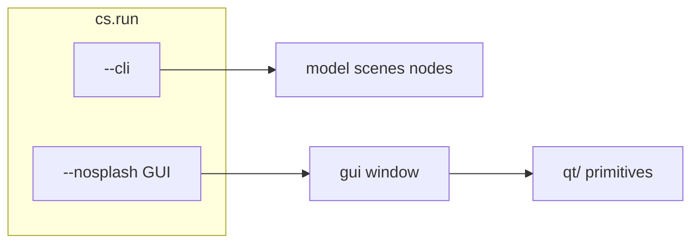

# ConnectEd scripting

Scripted tests, macros, and demos via [`ConnectEd/scripting/`](../ConnectEd/scripting/).

## Two runtime modes

| Mode | Entry | Typical use |
|------|--------|-------------|
| **CLI** | `cs.run(fn, ["--cli"])` | Model, scenes, nodes — no `Window`. Headless CI, batch logic. |
| **GUI** | `cs.run(fn, ["--nosplash"])` + `cs.gui(window)` | Full window, menus, modals, QTest mouse on views. |



**Tests:** [`test_scripted_cli.py`](../tests/integration/test_scripted_cli.py), [`test_scripted_gui.py`](../tests/integration/test_scripted_gui.py).

---

## GUI driver (`gui`)

```python
import ConnectEd.scripting as cs

def test(app: cs.App) -> None:
    window = app.window()
    driver = cs.gui(window)

    bar = driver.menuBar()
    about = bar.getMenus()["Help"].getAction("About")
    driver.withModal(about.trigger, onAbout)

cs.run(test, ["--nosplash"])
```

- **`driver.window()`** → ConnectEd [`Window`](../ConnectEd/widgets/window/__init__.py) (chrome/dock accessors: `navigatorDock()`, `mdiArea()`, …).
- **`driver.menuBar()`** → [`MenuBar`](../ConnectEd/widgets/window/menu_bar/__init__.py) with `getMenus()`, `getAction()`.
- Navigation uses **ConnectEd menu/action APIs**, not raw `QMenuBar` walks.

Factory: [`ConnectEd/scripting/gui.py`](../ConnectEd/scripting/gui.py). Qt delivery: [`ConnectEd/scripting/qt/`](../ConnectEd/scripting/qt/) (`core`, `modal`, `shell`, `mouse`).

Import: `import ConnectEd.scripting as cs`. Methods under `scripting/` use **camelCase** (`processEvents`, `withModal`, `mouseDrag`).

---

## QTest mouse (`qt/mouse.py`)

Delivers real Qt mouse events into widgets (e.g. [`DrawingView`](../ConnectEd/widgets/graphics/views/drawing/mouse.py)):

| Method | Role |
|--------|------|
| `mousePress` / `mouseMove` / `mouseRelease` | Explicit gesture steps; `processEvents()` after each |
| `mouseClick(widget, pos, …)` | Press + release at viewport coordinates |
| `mouseDrag(widget, pos1, pos2=None, …)` | Full drag; `pos2=None` leaves button held |
| `viewPos(view, scene)` / `scenePos(view, view_pt)` | Scene ↔ viewport mapping |

**Drag threshold:** ConnectEd enters drag state only after move distance ≥ `settings().get("prefs/mouse/drag")`. Use a large enough delta between `pos1` and `pos2`.

**Example:** [`examples/scripts/gui.py`](../examples/scripts/gui.py) — File → New → Design, `view.placeRectangle()`, `driver.mouseDrag(view, p1, p2)`.

---

## Modals (`withModal`)

Blocking dialogs (e.g. `QMessageBox.about`) need the opener scheduled on the next event-loop tick:

```python
def onAbout() -> None:
    modal = driver.activeModal()
    assert modal is not None
    modal.accept()

driver.withModal(about.trigger, onAbout)
```

See [`qt/modal.py`](../ConnectEd/scripting/qt/modal.py).

---

## Integration test layout

```
tests/integration/gui/
  specs.py              # MENUS, MAIN_WIDGETS, MAIN_WIDGET_ACCESSORS
  validators/
    main_window.py      # shell + widget types via Window accessors
    menus.py            # menu tree vs spec
    about.py            # Help → About
    drawing.py          # rectangle via QTest mouseDrag
  test_scripted_gui.py  # thin script: cs.run(test); one driver pass
```

Validators take a **`GuiDriver`**; they use `driver.window()` and ConnectEd types only.

---

## GUI in CI

| Requirement | Notes |
|-------------|--------|
| Real GUI process | `QApplication`, `Window`, event loop — not `--cli`. |
| Display | Linux: `QT_QPA_PLATFORM=offscreen` or `xvfb-run`. |
| Stability | `--nosplash`, `withModal` / `schedule`, `processEvents` — avoid arbitrary sleeps. |

```powershell
.venv\Scripts\python.exe -m pytest tests/integration/test_scripted_gui.py -v
```

---

## Package layout

```
ConnectEd/scripting/
  __init__.py      # run, App, gui(), Gui, type re-exports
  gui.py           # ConnectEd-aware driver
  qt/
    core.py        # processEvents, schedule, findChild, click
    modal.py       # withModal, activeModal
    shell.py       # dock helpers
    mouse.py       # QTest mouse API
    menus.py       # optional Qt menu helpers (not used in validators)
    protocol.py    # GuiDriver
```
