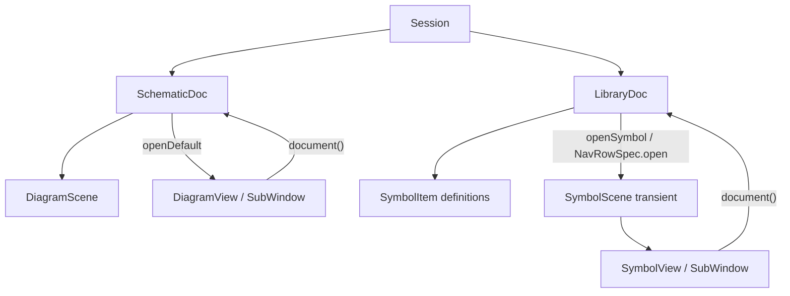
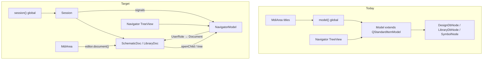
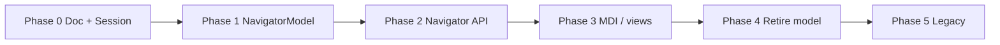

# Session migration plan

Migrate Navigator and view/scene APIs from the global **`model()`** to **`session()`**, introduce a UI-only **NavigatorModel**, and retire **`Model`** as a process-wide service.

Steps below are ordered for incremental delivery. You may complete individual tasks or whole phases manually; use the checkboxes to track progress.

**Related:** [`NEXT.md`](NEXT.md) (XML refactor, symbol work), [`SYMBOLS.md`](SYMBOLS.md), [`SCRIPTING.md`](SCRIPTING.md).

---

## State of play

**Still running:** legacy **`model()`** + Navigator on `DesignDbNode` tree. **In progress:** Session + **`Doc`** ABC + concrete docs under **`ConnectEd/documents/`**.

| Area | Status |
|------|--------|
| [`Session`](../ConnectEd/core/session.py) | Skeleton: registry, `open`/`new`/`save`/`close`, `openDocs`; **no Qt signals yet**; path not set on open/new; no path normalisation |
| [`Doc` ABC](../ConnectEd/core/doc.py) | **`NavRowSpec`**, template **`save()`** → subclass **`toXml()`**; **`navigatorChildren()`**; stubs for open/rename |
| [`SchematicDoc`](../ConnectEd/documents/schematic.py) | WIP: path, `fromXml`/`toXml`; **`navigatorChildren()`** sketch; **`openDefault`** etc. not implemented; references **`DocNavKind`/`children`** not yet on `NavRowSpec` |
| [`LibraryDoc`](../ConnectEd/documents/library.py) | Stub only |
| [`fsm.py`](../ConnectEd/documents/fsm.py) | Placeholder |
| Registry | Still **`DiagramScene`** in [`diagram/__init__.py`](../ConnectEd/widgets/graphics/scenes/diagram/__init__.py) (broken `DiagramDoc` stub); target **`SchematicDoc`** + register from `documents/schematic.py` |
| **NavigatorModel** | Not started — Navigator still uses global **`model()`** |
| **`editor.document()`** | Not wired on views/scenes/subwindows |
| **Session signals** | Not implemented |
| **File → Save** | Still `view.scene()` in [`menu_bar/slots.py`](../ConnectEd/widgets/window/menu_bar/slots.py) |

---

## Goals

| Goal | Outcome |
|------|---------|
| **Session owns documents** | Open/new/close, load/save/save-as, path dedup; editor→doc lookup where needed |
| **NavigatorModel owns the tree** | Rows from Session + **`NavRowSpec`** trees from each **`Doc`** |
| **Navigator is document-agnostic** | Open/save/close via **`Doc`** and **`NavRowSpec.open`** |
| **Editors link to documents** | Views/scenes/subwindows expose **`document()`** for File → Save/Close |
| **Retire `model()` global** | Remove `Model` from `app.py` / `main.py`; shrink or delete `core/db.py` **`Model`** |

---

## Design decisions (agreed)

| Concept | Decision |
|---------|----------|
| **Document** | **`Doc` ABC** in [`core/doc.py`](../ConnectEd/core/doc.py); concretes in **`ConnectEd/documents/`** (`SchematicDoc`, `LibraryDoc`, …) — not a scene or widget |
| **Naming** | Code uses **`Doc`** / **`SchematicDoc`** / **`LibraryDoc`** (not `DiagramDocument` / `LibraryDocument` in filenames) |
| **Path** | On document (`path()` / `setPath`); `""` = unsaved |
| **Registry** | `DocType` with `name`, `group`, `ext`, `tag`, `cls` — `cls` is a **`Doc` subclass** |
| **`_doc_types`** | `dict[str, DocType]` keyed by **`tag`** (XML tag), not friendly name |
| **`new(tag)`** | `tag` = type discriminator (e.g. `"Diagram"`, `"Library"`), not instance id |
| **Persistence** | **`Doc.save()`** template on ABC (uses `saveBegin`/`saveEnd`); subclass implements **`toXml()`** / **`fromXml()`** |
| **Registration** | `Session.registerDocType(...)` — target: import from **`documents/*.py`**, not widget modules |
| **Navigator groups** | Top-level rows from `DocType.group` |
| **Navigator** | **Document-agnostic** — tree from **`NavRowSpec`**; open via **`NavRowSpec.open`** / **`doc.openDefault()`** |
| **Editors** | Transient UI; **`document()`** back-ref on subwindow (canonical), view, scene |
| **Not on Session** | `QModelIndex`, tree shape details — stay on **NavigatorModel** |

**Session owns:** open/close/new, load/save/saveAs, path dedup, **`documentChanged`** (and related) signals for Navigator/MDI sync.

**Not on Session:** Qt model indices; per-doc tree layout (each **`Doc`** supplies **`NavRowSpec`** trees).

---

## Code layout

```
ConnectEd/
  core/
    doc.py          # Doc ABC, NavRowSpec
    session.py      # Session, DocType, registerDocType
  documents/        # concrete Doc subclasses (not under widgets/)
    schematic.py    # SchematicDoc
    library.py      # LibraryDoc
    fsm.py          # future
  widgets/          # scenes, views, MDI — editors only; document() back-ref
doc/                # markdown (SESSION.md) — unrelated to Python package
```

Dependency rule: **`core`** does not import **`widgets`**; **`documents`** may import both.

---

## Document model

A **document** (`Doc` instance) is persistent data in **`Session._open_docs`**. It is not an MDI subwindow, not necessarily a `QGraphicsScene`, and not a Navigator `QStandardItem`.

Editors are **transient**. Saving always targets the **`Doc`**, even when the active UI is a library symbol editor.



### Document kinds

| Doc class | Persistent contents | Open |
|-----------|---------------------|------|
| **`SchematicDoc`** | `DiagramScene` + diagram symbol cache ([`SYMBOLS.md`](SYMBOLS.md)) | **`openDefault()`** → diagram MDI |
| **`LibraryDoc`** | **`SymbolItem`** definitions | **`openSymbol(id)`** / row **`open` callable** → transient **`SymbolScene`** + MDI |

A **library is not a scene**. **`SymbolScene`** exists only while editing ([`SYMBOLS.md`](SYMBOLS.md)).

### `Doc` responsibilities (ABC)

| Area | API |
|------|-----|
| **Persistence** | `path`, `setPath`, `toXml`, `fromXml`; **`save()`** on ABC |
| **Doc row (L2)** | **`displayName()`** / **`setDisplayName()`** — not a `NavRowSpec` |
| **Child rows** | **`navigatorChildren()`** → tree of **`NavRowSpec`** |
| **Rename child** | **`renameNavigatorChild(id, label)`** |
| **Open** | **`openDefault()`**; optional **`openChild(id)`** — or only callables on specs |

Navigator calls **`doc.openDefault()`**, **`nav_row.open()`**, **`session().save(doc)`** — no `DesignDbNode` types.

---

## NavRowSpec and Navigator tree

**`NavRowSpec`** ([`core/doc.py`](../ConnectEd/core/doc.py)) is a **spec** for one Navigator row under a document. NavigatorModel turns specs into `QStandardItem`s. Renamed from ~~`DocNavItem`~~.

```python
@dataclass
class NavRowSpec:
    id       : str
    label    : str | Callable[[], str]   # agreed; implement when refreshing labels
    editable : bool = True
    open     : Callable[[], None] | None = None   # None => container; callable => editor row
    children : list[NavRowSpec] = field(default_factory=list)   # agreed; add to dataclass
```

| `open` | Row behaviour |
|--------|----------------|
| **`None`** | **Container** (e.g. `"Symbols"`) — expand/collapse via twisty; double-click may toggle expand (library pattern) |
| **callable** | **Editor row** — double-click / Enter calls **`open()`** |

**Document row (L2)** is **not** in `navigatorChildren()`. It is the open-doc row in NavigatorModel: text from **`doc.displayName()`**, tooltip from **`doc.path()`**.

### Schematic symbol cache (agreed tree)

```text
Schematic Diagrams                 (L1 group — DocType.group)
  CPU Board                          (L2 doc — displayName(); dbl-click → openDefault())
    Symbols                          (L3 container — label "Symbols", open=None)
      ALU                            (L4 editor — open=lambda: doc.openSymbolDef(...))
      Reset
```

- Double-click **doc row** → **`openDefault()`** only — **does not** expand/collapse (override Qt folder behaviour by row role).
- Expand **Symbols** via twisty or double-click **container** row.
- **`id`** on each spec is opaque to Navigator; used for rename, **`documentChanged(row_ids)`**, editor reuse keys — not a shared cross-doc index scheme.

**No `doc.navigatorLabel(row_id)`** — dynamic text via **`label: Callable[[], str]`** (re-evaluated on refresh), avoiding a second id→text API.

Store **`NavRowSpec`** (or copy) on row **`UserRole`** so refresh can re-call callables without rebuilding the whole tree.

---

## Navigator / MDI display text

| Surface | Primary | Secondary |
|---------|---------|-----------|
| **Navigator doc row** | **`displayName()`** (diagram name attribute) | Tooltip: full **`path()`** if saved; `(not saved)` if `path == ""` |
| **MDI drawing title** | **`{displayName()} — Diagram Editor`** | Tooltip: path |
| **Static nav row** | `"Symbols"` string on **`NavRowSpec.label`** | — |
| **Symbol nav row** | callable **`label`** → current symbol name | — |

If name unset, fall back to basename without extension for display; path stays in tooltip.

---

## Labels and change notification

When domain data changes (e.g. **`DiagramScene`** name, symbol rename in editor):

```text
DiagramScene.setName / property change
    → scene.document()  (if set)
    → SchematicDoc syncs displayName / domain
    → Session.notifyDocumentChanged(doc, row_ids=None | {id, ...})
    → Qt signal documentChanged
    → NavigatorModel: update doc row and/or re-resolve NavRowSpec labels (call callables)
    → MDI: mdiArea.update() for titles
```

- **`row_ids is None`** — refresh doc row and/or rebuild nav subtree (symbol added/removed).
- **`row_ids = {id}`** — re-resolve label for those nav rows (call **`label()`** if callable).
- **Tree inline rename** → **`renameNavigatorChild(id, label)`** → doc updates domain → emit **`documentChanged`** for MDI.

**Do not** register Navigator callbacks on **`Doc`**. **Session** is the broadcast bus; multiple listeners (NavigatorModel, MDI) subscribe.

Reverse path (tree rename → scene): **`setDisplayName`** / **`renameNavigatorChild`** updates scene name, then notify Session.

---

## Opening editors and reuse

**Navigator does not query `mdi_area` for reuse.** **`Doc.openDefault()`**, **`LibraryDoc.openSymbol()`**, or **`NavRowSpec.open`**:

1. Look for existing subwindow (by **`document()`** + optional symbol **`id`**, or scene).
2. If found → **`mdiArea().activateSubWindow(...)`**.
3. Else create scene/view/subwindow, set **`document()`** (and symbol id on subwindow/scene), **`addSubWindow`**, show.

Optional shared helper in **`documents/editor.py`** for focus-or-create MDI (used by schematic + library).

| Object | **`document()`** |
|--------|------------------|
| **SubWindow** | Canonical — set at creation |
| **View** | Delegate to subwindow or set at creation |
| **Scene** | Set at creation (spreadsheet / code paths that only have scene) |

**File → Save:** **`view.document()`** → **`session().save(doc)`** — not **`view.scene()`**.

Migration shim **`docForScene`** only until all editors expose **`document()`**; then remove.

---

## Current vs target architecture



### Responsibility map

| Responsibility | Today (`Model`) | Target |
|----------------|-----------------|--------|
| Open / new / close | `Model.load`, `newDesignDbNode`, `close` | `session().open` / `new` / `close` |
| Save / path / dedup | `DbNode.path` / `save` | **`Doc.save()`** + `session().save` / `saveAs` |
| Active editor → doc | `getDbNodeFromScene` | **`editor.document()`** |
| Navigator tree | `DesignDbNode` hierarchy | **`NavRowSpec`** tree from **`navigatorChildren()`** |
| Open selection | `_editDrawing(node)` | **`openDefault()`** / **`NavRowSpec.open()`** |
| Label updates | `itemChanged` on db nodes | **`documentChanged`** + callable **`NavRowSpec.label`** |
| Tree / indices | Domain objects are tree rows | **NavigatorModel** only |
| MDI close on doc close | `Model.close` → `window()._mdi_area` | Listener on Session signal → `mdiArea().closeScene` |
| Tree clipboard | `Model.copy` / `paste` | NavigatorModel or Session (Phase 4) |

### Bootstrap today

[`main.py`](../ConnectEd/main.py) sets both `Session()` and `Model()`. Navigator still binds to `model()` only ([`navigator/__init__.py`](../ConnectEd/widgets/window/navigator/__init__.py)).

Diagram registration (already in place):

```python
Session.registerDocType(
    "Schematic Diagram", "Schematic Diagrams", ".sch", "Diagram", DiagramScene
)
```

Legacy UI still uses `.dsn` / `<Design>` via `DesignDbNode` — see **Known gaps**.

---

## Known gaps

### Done / in progress

- [x] **`Doc` ABC** in [`core/doc.py`](../ConnectEd/core/doc.py) — persistence template, **`NavRowSpec`**, navigator hooks (stubs)
- [x] **`ConnectEd/documents/`** package — **`SchematicDoc`** WIP, **`LibraryDoc`** stub
- [x] **`Session`** imports **`Doc`** from `core/doc.py` (not duplicated Protocol)
- [ ] **`NavRowSpec`** — add **`children`**, **`label: str | Callable`**, drop **`kind`** in favour of **`open is None`**

### Still to do

- [ ] **`SchematicDoc`** complete: **`displayName`** from scene, **`openDefault`**, fix **`navigatorItem`** recursive search, align with final **`NavRowSpec`**
- [ ] Register **`SchematicDoc`** (move `registerDocType` off **`DiagramScene`** in [`diagram/__init__.py`](../ConnectEd/widgets/graphics/scenes/diagram/__init__.py))
- [ ] **`Session`**: path on open/new; path normalisation; **`documentOpened` / `Closed` / `Changed`** signals
- [ ] **`toXml` envelope** — align **`SchematicDoc.toXml`** with `saveBegin`/`saveEnd` (payload vs full file); see [`core/xml.py`](../ConnectEd/core/xml.py)
- [ ] **`editor.document()`** on views/scenes/subwindows
- [ ] **Scene → doc notify** on name change → Session signal
- [ ] **NavigatorModel** + wire Navigator off **`model()`**
- [ ] **File → Save** via **`view.document()`**
- [ ] Legacy **`.dsn` / `<Design>`** vs **`.sch` / `<Diagram>`**
- [ ] **`Model.close`** UI coupling in [`core/db.py`](../ConnectEd/core/db.py)

---

## Symbol / library handling

| Layer | Role |
|-------|------|
| **`LibraryDoc`** | Owns **`SymbolItem`** definitions; **`openSymbol(id)`** builds/focuses MDI |
| **`SymbolScene`** | Transient; **`document()` → LibraryDoc** |
| **`SchematicDoc`** | Owns **`DiagramScene`** + symbol cache; **`NavRowSpec`** tree with **Symbols** container |

Opening a library symbol: **`LibraryDoc.openSymbol(...)`** — **`SymbolScene` + `SymbolView` + `SymbolSubWindow`**, set **`document()`**, reuse via doc + **`mdi_area`** (not Navigator).

Saving while editing a symbol: **`view.document()`** → **`session().save(libraryDoc)`** — flush scene → **`SymbolItem`** before serialise.

---

## Phase 0 — Foundation (Session + Doc)

**Objective:** Session + concrete docs usable without Navigator cutover.

- [x] **`Doc` ABC** + template **`save()`** in [`core/doc.py`](../ConnectEd/core/doc.py)
- [ ] Finalise **`NavRowSpec`** (`children`, callable `label`, `open`)
- [ ] Complete **`SchematicDoc`**; register in Session from **`documents/schematic.py`**
- [ ] **`LibraryDoc`** stub → minimal open/save path
- [ ] **`Session`**: path on open/new; normalise paths; **`documentChanged`** (+ opened/closed) signals
- [ ] **`editor.document()`** + scene name → doc → Session notify
- [ ] Menu bar Save/Close via **`view.document()`**
- [ ] Unit tests: registry, save, **`documentChanged`**

**Exit:** `session().new("Diagram")` + save; GUI Save on schematic uses **`Doc`**.

---

## Phase 1 — NavigatorModel

**Objective:** Navigator uses a dedicated tree model synced from Session.

- [ ] New **`NavigatorModel`** (e.g. `widgets/window/navigator/model.py`)
- [ ] Top-level **group rows** from `session().docTypes()` → `DocType.group`
- [ ] Build tree from **`navigatorChildren()`** — recursive **`NavRowSpec`**; store spec on **`UserRole`**
- [ ] On **`documentChanged`**: refresh doc row / re-call **`label()`** / rebuild subtree
- [ ] **`Navigator.__init__`**: use NavigatorModel, not `model()`
- [ ] Helpers: `indexForDocument`, `documentForIndex`; **`onItemChanged`** → **`renameNavigatorChild`**
- [ ] Double-click: doc row → **`openDefault()`**; **`open is None`** → expand; callable → **`open()`**

**Files:** new `navigator/model.py`, `navigator/__init__.py`, app/window bootstrap for NavigatorModel lifetime

**Exit:** Tree shows groups + docs when Session is manipulated directly (test harness), without legacy `Model`.

---

## Phase 2 — Navigator API switch

**Objective:** Navigator file operations use Session; indices use NavigatorModel.

| Today | Replacement |
|-------|-------------|
| `model().load(path)` | `session().open(path)` + NavigatorModel insert + expand/select |
| `model().newDesignDbNode()` | `session().new("Diagram")` + **`SchematicDoc.openDefault()`** |
| `model().newLibraryDbNode()` | `session().new("Library")` + **`LibraryDoc`** |
| `model().close(node)` | `session().close(document)` + model remove + MDI via listener |
| `model().getDbNodeFromScene(x)` | **`x.document()`** if set; else migration shim |
| `_save` / `_saveAs` on `DbNode` | `session().save(document)` / `saveAs(document, path)` |
| `navigator().save(scene)` | **`navigator().save(document)`** or `saveFromEditor(view)` |
| `model().indexFromItem(node)` | `navigatorModel().indexForDocument(document)` |
| `model().copy` / `paste` | Defer to Phase 4 or stub |

- [ ] Update [`navigator/api.py`](../ConnectEd/widgets/window/navigator/api.py)
- [ ] Update [`navigator/private.py`](../ConnectEd/widgets/window/navigator/private.py)
- [ ] Update [`navigator/overrides.py`](../ConnectEd/widgets/window/navigator/overrides.py)
- [ ] **Navigator API**: `save(document)`, `close(document)`, `openSelection(index)` — document-centric, not scene/db-node typed
- [ ] **Context menus**: **`DocType.tag`** + container vs editor (`open is None` vs callable); optional menu tag on spec if needed

**Exit:** File → New/Open/Save/Close from [`menu_bar/slots.py`](../ConnectEd/widgets/window/menu_bar/slots.py) with no `model()` in navigator code.

---

## Phase 3 — View / scene APIs

**Objective:** Opening and MDI titles use **`Document`**, not db-node/scene typing.

- [ ] **`openDefault` / `NavRowSpec.open`** replace **`_editDrawing` / `_newDrawingWindow`**
- [ ] **`LibraryDoc.openSymbol`** — transient scene + MDI + **`document()`**
- [ ] **`MdiArea`**: titles from **`subwindow.document().displayName()`**
- [ ] **`documentClosed` listener**: close editors whose **`editor.document()`** matches
- [ ] **`onItemChanged`**: MDI title refresh via `mdiArea().update()`

**Exit:** No `getDbNodeFromScene`; no `isinstance(..., DesignDbNode)` in navigator private paths.

---

## Phase 4 — Retire global `Model`

- [ ] Move tree **`copy` / `paste`** to NavigatorModel or Session
- [ ] Remove domain methods from **`Model`** or delete class ([`core/db.py`](../ConnectEd/core/db.py))
- [ ] Remove `_model`, `setModel`, **`model()`** from [`app.py`](../ConnectEd/app.py)
- [ ] Remove `app.setModel(Model())` from [`main.py`](../ConnectEd/main.py)
- [ ] Update CLI/scripts: [`examples/scripts/cli.py`](../examples/scripts/cli.py), [`test_scripted_cli.py`](../tests/integration/test_scripted_cli.py) → `session().new("Diagram")`
- [ ] Update GUI validators: [`tests/integration/gui/validators/drawing.py`](../tests/integration/gui/validators/drawing.py)
- [ ] Grep gate: no `from ...app import model` in `navigator/`, `mdi_area.py`, `menu_bar/`

**Exit:** `grep model()` under `ConnectEd/` hits only Qt `index.model()` and unrelated AI chat model.

---

## Phase 5 — Legacy and cleanup (follow-on)

- [ ] **`.dsn` / `<Design>`** adapter or migration to `<ConnectEd><Diagram>`
- [ ] Drop **`DesignDbNode` / `LibraryDbNode` / `SymbolNode`** from domain layer
- [ ] **`LibraryDoc`** full save/load with **`SymbolItem`**
- [ ] XML refactor per [`NEXT.md`](NEXT.md) (slurp, retire `core/xml.py` for graphics)

---

## Execution order



**Suggested next steps:** (1) finalise **`NavRowSpec`** in code; (2) complete **`SchematicDoc`** + registry; (3) **`documentChanged`** on Session; (4) **`NavigatorModel`**.

---

## Navigator call-site reference (migration targets)

| File | `model()` usage today |
|------|------------------------|
| [`navigator/__init__.py`](../ConnectEd/widgets/window/navigator/__init__.py) | Tree model, `itemChanged` |
| [`navigator/api.py`](../ConnectEd/widgets/window/navigator/api.py) | new/load/save/close/copy/paste, `getDbNodeFromScene` |
| [`navigator/private.py`](../ConnectEd/widgets/window/navigator/private.py) | load, close, `indexFromItem` |
| [`navigator/overrides.py`](../ConnectEd/widgets/window/navigator/overrides.py) | `itemFromIndex` |
| [`mdi_area.py`](../ConnectEd/widgets/window/mdi_area.py) | `getDbNodeFromScene` for window titles |
| [`menu_bar/slots.py`](../ConnectEd/widgets/window/menu_bar/slots.py) | `save/close(view.scene())` → **`view.document()`** |

Menu bar routes Save/Close through the active **`DrawingView`** → must use **`view.document()`**, not `view.scene()`, so library symbol editors save the **`LibraryDocument`**.

---

## Test plan

| Area | Check |
|------|-------|
| Session | Registry; **`documentChanged`**; save path |
| NavRowSpec | Callable labels refresh; Symbols container + nested symbols |
| Editor | **`document()`**; scene rename → Session signal |
| Integration | GUI validators assert `session().openDocs()` |
| Grep | No app-level `model()` in navigator / mdi / menu_bar |

---

## Files checklist

| Area | Files |
|------|-------|
| Session | `ConnectEd/core/session.py` |
| Doc / NavRowSpec | `ConnectEd/core/doc.py` |
| Concrete docs | `ConnectEd/documents/schematic.py`, `library.py`, `fsm.py` |
| Registry | move to `documents/schematic.py`; clean [`diagram/__init__.py`](../ConnectEd/widgets/graphics/scenes/diagram/__init__.py) |
| Views / editors | `document()` on DiagramView, SymbolView, subwindows, scenes |
| Navigator model | **new** `ConnectEd/widgets/window/navigator/model.py` |
| Navigator | `navigator/__init__.py`, `api.py`, `private.py`, `overrides.py`, `menus.py` |
| MDI | `ConnectEd/widgets/window/mdi_area.py` |
| App | `ConnectEd/app.py`, `ConnectEd/main.py` |
| Legacy | `ConnectEd/core/db.py` |
| Tests / scripts | `tests/integration/*`, `examples/scripts/*`, unit fixtures using `DesignDbNode` |

---

## Manual work notes

Use this section for ad-hoc notes while stepping through the plan (branch names, decisions, blockers):

```
(2025-06-14) — Doc ABC + documents/ package. NavRowSpec (was DocNavItem).
  container = open is None; editor = open callable. Nested children for Symbols folder.
  displayName on doc row; path in tooltip; MDI "{displayName} — Diagram Editor".
  Labels: str | Callable on NavRowSpec; refresh via Session.documentChanged (not navigatorLabel).
  Change chain: scene → doc → Session signal → NavigatorModel + MDI.
  LibraryDoc.openSymbol owns MDI assembly; Navigator does not query mdi_area for reuse.
  doc/ markdown vs ConnectEd/documents/ Python — no naming conflict.
```
