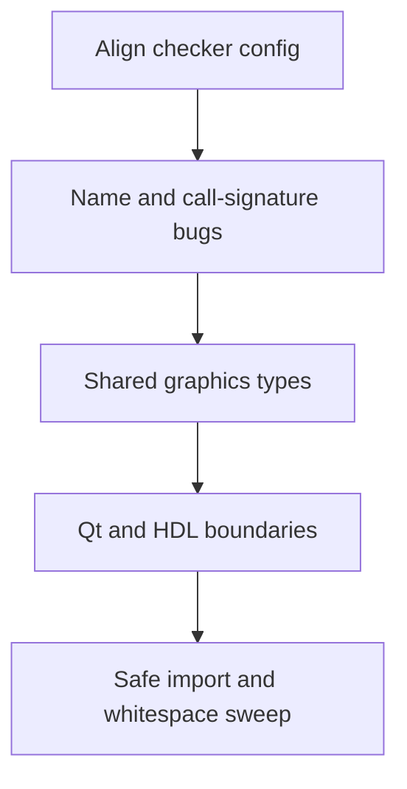

# Fix lint and type errors without fighting the APIs

Clear the real ruff and mypy findings in an order that follows the codebase's existing APIs. Checker config absorbs house style and generated files first, so later edits only touch genuine drift and a few shared types.

The IDE Pyright workspace check (standard mode, `hdl/`, `tests/`, and `examples/` excluded in `.vscode/settings.json`) currently reports nothing. The noise is from the CLI checkers, and most of it is not application bugs.

- **Ruff:** 4094 findings. About 3750 are the four ANTLR outputs (`vhdl_lexer.py`, `vhdl_parser.py`, `vhdl_parserListener.py`, `vhdl_parserVisitor.py`). Of the remaining 344, 201 are line length and most of the rest are naming or unused imports.
- **Mypy:** about 5800 findings, about 5400 of them in those same generated files. Handwritten `ConnectEd` is **385** errors, and **203** of those sit under `ConnectEd/widgets/graphics`.
- **Flake8** duplicates Ruff. Do not run a second cleanup against it.
- `tools/coding_style.py` is already clean. Its alignment rules are why many lines exceed Ruff's 88 columns.

## What not to fix

- Do not restyle camelCase (`N802` is already ignored; `N801` / `N803` / `N806` / `N815` are the same house style) or reflow vertically aligned lines to satisfy `E501`.
- Do not edit ANTLR output, and do not start the optional-elimination notes in `doc/NONE.md`. Many `None` results are real domain states.
- Do not delete public re-exports that Ruff calls unused: `ConnectEd/hdl/__init__.py` and `AiChatDock` / `AiEditLock` in `ConnectEd/widgets/window/__init__.py`.
- Do not put `spos` back on `DiagramViewState.go`. It always uses `view._mouse_spos`. The one drifted caller is `placeNetLabelOnSegment` in `ConnectEd/widgets/graphics/views/diagram/api/place.py`, which still passes `spos=`.

## 1. Make the checkers describe this repo

In `pyproject.toml`:

- Move `select` / `ignore` under `[tool.ruff.lint]` (Ruff already warns that the top-level keys are deprecated).
- Ignore the camelCase naming rules above, and ignore `E501`.
- Exclude the four ANTLR files from Ruff and from Mypy, matching `SKIP_FILES` in the style checker.
- Leave Mypy's `disallow_untyped_defs` on. After the generated files are excluded, only about 40 handwritten functions lack annotations.

## 2. Repair names and call sites that no longer match

These are small and independent of the graphics type model:

- `tests/unit/ai/test_tools.py`: two skipped tests call `set_sheet`, which was never added. Keep the AI surface incomplete; stop the tests from naming a function that does not exist (drop or comment the bodies until the tool exists). Move the mid-file `import pytest` back to the top.
- `tests/unit/widgets/test_item_role.py`: `_item_classes` is gone. Point the parametrized test at the live item registry, or remove that one test if registration no longer exposes a class map.
- `tests/unit/test_vhdl.py` line 202: nested quotes inside an f-string are invalid on the project's Python 3.11 target. The module does not parse.
- `placeNetLabelOnSegment`: stop passing `spos=` into `go`. The placement state already snaps `view._mouse_spos`.
- `DiagramSceneXmlMixin.fromXml`: `cls(doc=None, fresh=False)` is typed as the mixin, whose constructor has no such arguments. Construct `DiagramScene` after the `issubclass` check. That class already accepts `doc` and `fresh`.

## 3. Fix shared graphics types once

Most of the 203 graphics errors are the same few mechanisms. Fix the mechanism, then re-run Mypy before editing individual items.

- **Self-import of `DiagramInteraction`.** `ConnectEd/widgets/graphics/views/diagram/interaction/__init__.py` imports `DiagramInteraction` from itself under `TYPE_CHECKING` and also defines the class. Mypy reports a redefinition, then tells `move.py` the name is missing. Delete that self-import.
- **`PropertySpec[T]` is invariant.** Item dicts such as `PropertySpec[NetLabelItem]` cannot be stored where a base class declared `PropertySpec[BaseTextItem]`, and merging those dicts with `|` fails in `symbol.py`. Widen the stored spec to `PropertySpec[Any]` (or one protocol) in `properties.py` and the mixin registries. Do not give each item its own dict type.
- **Class-body lambdas.** `ItemTransformMixin` calls `mirrorH` / `setMirrorH` inside `PropertySpec` lambdas before Mypy has a type for those methods (`has-type`, 63 errors, mostly this pattern). Give those callables an explicit type, or build the property tables after the methods exist. Apply that same pattern wherever Mypy still reports `has-type` on a property lambda.
- **Host mixins are not the scene.** Where a mixin method needs `netlist`, `resources`, or scene construction, narrow with the existing `asDiagramScene` / `asDiagramView` helpers instead of annotating the mixin as `QGraphicsScene`.

## 4. One Qt boundary, then the HDL models

`ConnectEd/hdl/hdl_model.py` (44) and `vhdl_model.py` / `vhdl_visitor.py` (41) are published API. Adjust types, do not remove methods.

- `QStandardItem.child()` is `QStandardItem | None`. Add one narrow helper and use it in the model list comprehensions, instead of casting at each row.
- `data` / `setData` overrides must keep Qt's signature. If Mypy still disagrees with the stubs, mark those overrides only.
- `base_text.py` assigns `self.paint` on purpose. Keep that, and tell Mypy at that assignment rather than redesigning paint.
- Restored `CoreMixin.click` calls `QTest.mouseClick` with arguments the stubs reject. Cast at the call. Do not change the scripting method.
- Mutable defaults such as `ports: list[VhdlPort] = []` in the VHDL model are real defects (`B006`). Use `None` and create the list in the body, without changing the call shape.

## 5. Sweep only what the deletion pass left behind

After the steps above, Ruff's remaining handwritten findings should be unused imports, a few f-strings, and whitespace. Remove imports that served deleted helpers (for example `inspect` / `importlib` / `re` in `core/utils.py`). Leave package re-exports. Restrict `--fix` to whitespace and newline rules so it cannot reflow aligned code.

## Check

- `ruff check` on `ConnectEd`, `tests`, `tools`, `scripts`, `examples` is clean under the updated config.
- `mypy ConnectEd` is clean with the ANTLR files excluded.
- `tools/coding_style.py` stays at 0.
- Do not add new `# pyright: ignore` or `# type: ignore` except at the Qt boundaries named above.
